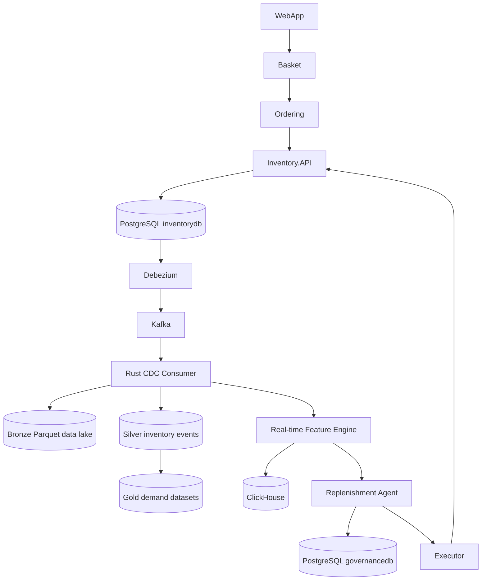
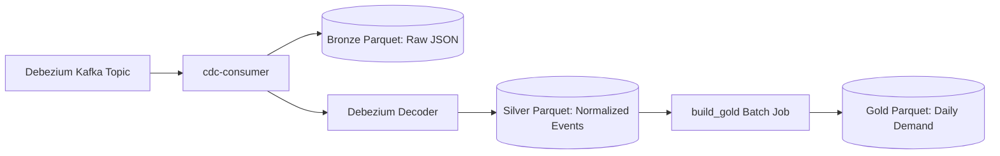
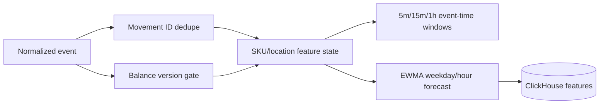
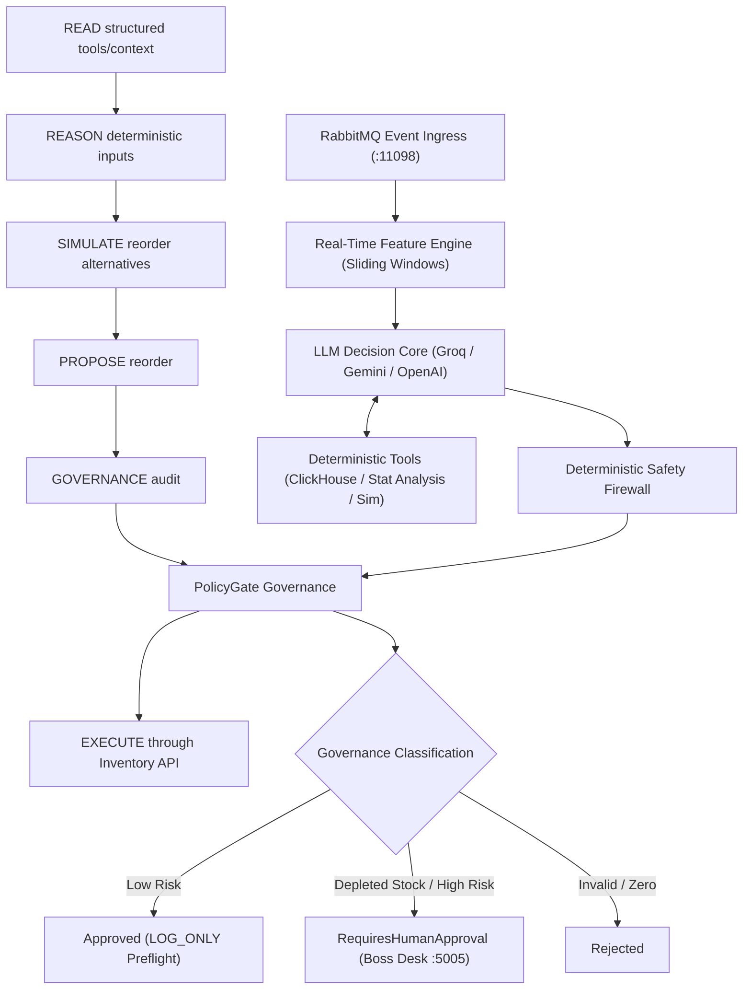
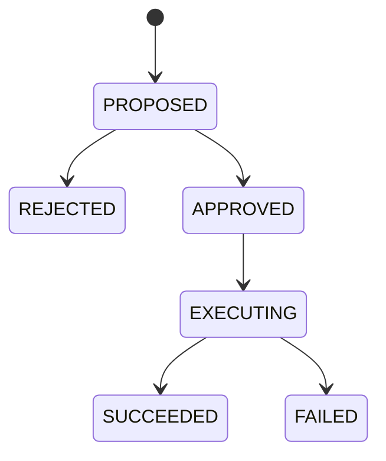
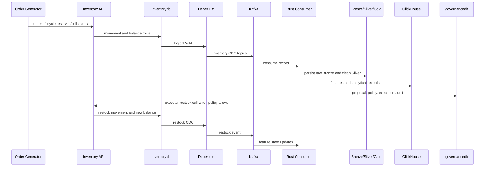

# Adaptive Inventory Replenishment Architecture

## System Architecture

Inventory PostgreSQL is the operational source of truth for stock. Kafka is event transport. The Bronze data lake is durable raw stream history. Silver and Gold Parquet are curated offline analytical datasets. ClickHouse is the fast analytical/read-model store. Governance PostgreSQL stores proposal and execution audit records. The agent explains and proposes; deterministic Rust policy and the executor control mutations.

## PostgreSQL Logical Replication

The local AppHost configures PostgreSQL with `wal_level=logical`, `max_replication_slots=10`, and `max_wal_senders=10` when `DataPlatform:Enabled=true`. Debezium uses the stable replication slot `eshop_inventory_cdc` and publication `eshop_inventory_publication`.

## Kafka Topics

Current topics consumed by the Rust data platform:

- `eshop.inventory.inventory_movements`
- `eshop.inventory.inventory_balances`

Future order/payment topics can use the same Bronze identity and partition layout.

## Data Lake Parquet Pipeline (Bronze / Silver / Gold)

The Data Lake Parquet pipeline ensures data durability and enables historical batch analytics (independent of real-time ClickHouse processing). It operates in three tiers:

1. **Bronze (Raw Data Backup)**: The `cdc-consumer` service reads Kafka messages and uses `polars` to write them precisely as-is into `data-lake/bronze/kafka/<topic>/date/hour/part-partition-offset.parquet`. Kafka offsets are committed only after this atomic write succeeds. Replays write the same deterministic path and are counted as duplicates.
2. **Silver (Cleaned/Normalized)**: Also generated in real-time by the `cdc-consumer`. The raw Debezium JSON is parsed, validated, and flattened into a strict schema (`SilverInventoryEvent`). This is saved to `data-lake/silver/inventory_events`.
3. **Gold (Analytical Aggregates)**: A standalone Rust batch job (`cargo run --bin build_gold`) scans the Silver Parquet folder. It filters for "Sale" movements, groups them by SKU, Location, and Date, and computes daily demand metrics, saving the results to `data-lake/gold/daily_demand/part-0000.parquet`.

## Real-Time Feature Flow

The feature engine keeps Reserve pressure separate from finalized Sale demand. Historical weekday/hour learning is updated from finalized event-time buckets, so repeated calculations do not overweight the same observation.

## Agent Decision Flow
## Agent Decision Flow (Hybrid Orchestrator)

The decision engine operates via the `hybrid-orchestrator`, implementing an autonomous multi-turn tool-calling loop bounded by a deterministic safety firewall and governance policy:

The LLM boundary is purpose-built. It receives deterministic decision and simulation outputs and returns validated structured reasoning. It does not receive generic SQL, database access, filesystem access, shell access, arbitrary HTTP, or direct Inventory write access.
The LLM is given 8 callable deterministic tools (including ClickHouse `event_calendar` for Indian festive surges and `supplier_disruption_signals` for freight delays). All arithmetic and warehouse queries execute deterministically in Rust. The `SafetyFirewall` validates capacity bounds and elevates stockout risk to at least `MEDIUM` to ensure that depleted stock is never auto-approved without human review.

For complete deep-dive specifications, see [src/RustDataPlatform/hybrid-orchestrator/ARCHITECTURE.md](../src/RustDataPlatform/hybrid-orchestrator/ARCHITECTURE.md).

## Governance State Machine

Governance records live in `governancedb` under the `governance` schema:

- `agent_evaluations`
- `reorder_simulations`
- `reorder_proposals`
- `policy_decisions`
- `execution_attempts`

## Complete Closed-Loop Demo

## Observability And Failure Handling

The Rust dashboard exposes `/health`, `/api/sku-locations`, and `/api/sku-locations/{sku}/{location}`. Health counters include consumed Kafka events, Bronze writes/duplicates, Silver writes/duplicates, normalization count, dead letters, duplicate movements, stale balances, decisions, simulations, proposals, policy decisions, executions, execution failures, LLM failures, and completed restocks.

Failure handling:

- Malformed CDC is stored in Bronze first, then written to dead letters.
- Duplicate Kafka delivery is idempotent by `topic + partition + offset`.
- Duplicate movements are idempotent by `movement_id`.
- Stale balances are rejected by Inventory balance version.
- Stale/unreconciled tool data blocks automatic execution.
- Inventory API conflicts are audited and do not mutate analytics into a false success.
- Production LLM provider fails closed until configured.

## Security Boundaries

Secrets are read from environment/configuration and are not committed. The agent has no raw database or shell access. Only the executor path can call Inventory API mutation endpoints, and it validates policy, identity, current inventory key, capacity, quantity, and idempotent operation ID first.
