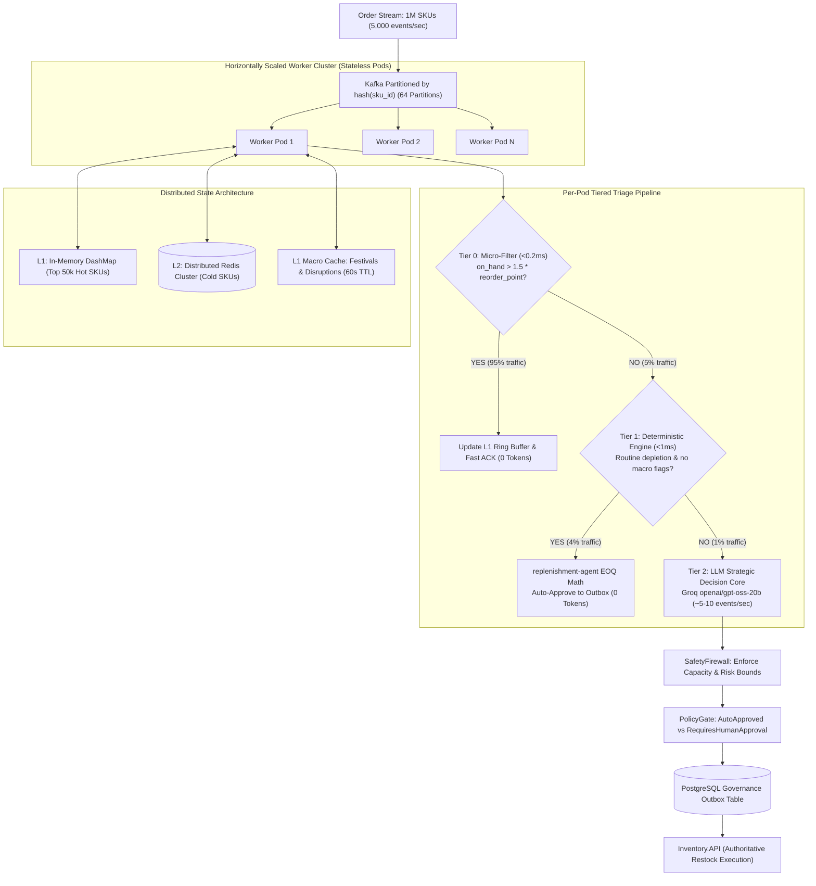

# Scaling the Autonomous Supply Chain Agent to 1,000,000 SKUs

## Executive Summary

| Question | Verdict | Rationale |
| :--- | :--- | :--- |
| **Can our agent handle 1M SKUs as-is today?** | **NO** | Single-process RAM exhaustion (~40GB heap), single RabbitMQ queue serialization, and unbounded LLM rate limits (exceeding 50M TPM). |
| **Can our underlying Hybrid Architecture handle 1M SKUs?** | **YES** | The separation of high-throughput deterministic math (Rust) from strategic contextual reasoning (LLM) is the exact industry standard for 1M+ SKU operations when paired with a **Tiered Triage Pipeline**. |

---

## 1. Deep Root Cause Analysis: The 5 Fatal Bottlenecks in the Current Code

### 1.1. RAM Exhaustion & Unbounded Heap Growth
In `hybrid-orchestrator/src/event_handler.rs`:
```rust
pub struct AppState {
    pub feature_states: Arc<Mutex<HashMap<SkuLocation, Mutex<SkuLocationState>>>>,
    pub seen_events: Arc<Mutex<HashSet<Uuid>>>,
    pub proposals: Arc<Mutex<HashMap<Uuid, ProposalRecord>>>,
}
```

- **The Math:** 
  - $1,000,000\text{ SKUs} \times 5\text{ fulfillment centers (BLR, DEL, BOM, HYD, MAA)} = \mathbf{5,000,000\text{ active pairs}}$.
  - Each `SkuLocationState` stores:
    - 3 sliding micro-windows (5m, 15m, 1h event ring buffers)
    - 8-day daily demand bucket array with EWMA smoothing and peak tracking
    - Current balance snapshot and inventory velocity metrics
  - Heap overhead per state $\approx 6\text{ KB} - 10\text{ KB}$.
  - $5,000,000 \times 8\text{ KB} \approx \mathbf{40\text{ GB to } 50\text{ GB}}$ of uncompressed RAM in a single process.
  - Monotonically growing `seen_events` and `proposals` without TTL or LRU eviction will trigger Linux OOM kills.

### 1.2. The LLM Token & Rate-Limit Wall
In `hybrid-orchestrator/src/event_handler.rs`, `propose_with_tools` is called for every valid depletion event that hits replenishment conditions:
- **E-Commerce Reality:** 1M SKUs generate **100 to 1,000 depletion events per second** during peak traffic.
- **Token Math:**
  - 1 LLM Tool Loop evaluation $\approx 3,500\text{ to }5,000\text{ tokens}$ (prompt, 8 compact tool definitions, snapshot, mandatory calendar/signals queries, chain-of-thought reasoning).
  - At $200\text{ events/sec}$:
    $$\text{Token Load} = 200 \times 4,500 = 900,000\text{ tokens/sec} = \mathbf{54,000,000\text{ TPM}}$$
  - **Failure:** Groq Enterprise tier limit is ~500k to 2M TPM. 54M TPM is **$27\times$ over limit**, locking the service in permanent HTTP 429 exponential backoffs.
  - **Economics:** 54M TPM = 3.24 billion tokens/hour $\approx \mathbf{\$486/\text{hour}} = \mathbf{\$11,600/\text{day}}$ on routine items.

### 1.3. Single Queue Consumer & Global Mutex Contention
- `hybrid-orchestrator/src/main.rs` consumes from a single AMQP queue (`eshop.inventory.order_stock_confirmed`) on a single thread.
- The outer lock `Arc<Mutex<HashMap<SkuLocation, ...>>>` serializes state lookups across async workers, destroying multi-core scalability.

### 1.4. ClickHouse Point-Query Overload
- `llm_tools.rs` runs individual SQL queries over HTTP for `get_event_calendar` and `get_supplier_signals` per evaluation.
- 500 concurrent evaluations generate **1,000 point-queries/sec** against ClickHouse. ClickHouse is a columnar OLAP engine designed for wide parallel scans, not high-frequency point lookups; HTTP connection pools and thread pools quickly exhaust.

### 1.5. Lack of Multi-Node Sharding
- Deploying multiple replicas of `hybrid-orchestrator` without partitioning causes split-brain state: pods maintain unsynchronized EWMA forecasts and emit duplicate reorders for the same SKU.

---

## 2. The Scaled Enterprise Architecture (Target: 1M SKUs)



---

## 3. The 5 Core Improvements

### Improvement 1: The Tiered Triage Funnel (Pareto 80/20 Filtering)
The fundamental mistake in the naive implementation is treating the LLM as a data processor rather than a **Chief Strategy Officer**. 

| Tier | Traffic Share | Latency | Token Cost | Engine | Evaluation Criteria |
| :--- | :--- | :--- | :--- | :--- | :--- |
| **Tier 0: Micro-Filter** | **95.0%** | $<0.2\text{ms}$ | **0 Tokens** | Rust Invariant | Stock is healthy (`on_hand > 1.5 * reorder_point`), velocity is normal (`ratio < 1.2`). Update metrics, ACK Kafka. |
| **Tier 1: Deterministic Reorder** | **4.0%** | $<1.0\text{ms}$ | **0 Tokens** | `replenishment-agent` | Stock is below reorder point, demand pattern is stable, no festival in $\le 14$ days, no supplier disruption flags. Formulaic EOQ auto-approval. |
| **Tier 2: Strategic LLM Loop** | **1.0%** | $\sim 600\text{ms}$ | $\sim 4,000$ tokens | `hybrid-orchestrator` | Triggered **only** for anomalies: active stockouts (`on_hand <= 0`), near-term festivals (Diwali), supplier disruption signals, or Class-A high-value SKUs. |

**Financial & Throughput Impact:**
- At 5,000 events/sec total across 1M SKUs, Tier 2 receives only **~5 to 10 events/sec**.
- Token consumption drops from 54M TPM to **~150,000 to 250,000 TPM** (fits comfortably within standard enterprise quotas).
- Operating cost drops from **\$11,600/day** to **under \$20/day**.

### Improvement 2: Consistent Hash Partitioning by `hash(sku_id)`
- Migrate from single RabbitMQ queue to **Kafka or Redpanda** with 64 or 128 partitions.
- Partition key = `sku_id.to_string()`.
- **Guarantee:** All transactions for any specific SKU always land on the exact same partition and the exact same pod replica.
- **Benefit:** Pods do not require distributed locking or cross-pod synchronization to calculate sliding-window moving averages.

### Improvement 3: Tiered State Storage (L1 DashMap + L2 Redis Cluster)
- Replace monolithic `HashMap` with a two-tier cache:
  1. **L1 In-Memory (`DashMap` + LRU):** Holds the **Top 50,000 active/hot SKUs** in local pod memory. Lock-free concurrent read/writes.
  2. **L2 Redis / Dragonfly Cluster:** Stores the remaining 950,000 cold/long-tail SKUs as compact binary Protobuf blobs (`sku:{id}:loc:{code}`).
  3. **Lazy Hydration:** When a cold SKU receives an order, hydrate its state from Redis in $<0.5\text{ms}$, update the sliding window, and write back with a 24-hour TTL.
- **Memory Footprint:** Each pod consumes only **2 GB to 4 GB RAM** regardless of total SKU catalog size.

### Improvement 4: In-Memory Broadcast Cache for Macro Signals
- The Indian festive calendar (`event_calendar`) and supplier risk flags (`supplier_disruption_signals`) change at macro frequencies (hours or days).
- Rather than executing HTTP queries against ClickHouse during each LLM tool call, maintain an **In-Memory TTL Cache** (`Arc<RwLock<MacroContext>>`) refreshed in the background every 60 seconds.
- Tool calls resolve in **$<1\mu\text{s}$ in local RAM**, completely isolating ClickHouse from high-frequency point-query load.

### Improvement 5: Transactional Outbox for Proposals & Idempotency
- Replace in-memory `proposals` and `seen_events` with PostgreSQL tables:
  ```sql
  CREATE TABLE governance.reorder_proposals (
      proposal_id UUID PRIMARY KEY,
      sku_id BIGINT NOT NULL,
      location_code VARCHAR(16) NOT NULL,
      quantity INT NOT NULL,
      status VARCHAR(32) NOT NULL,
      reasoning JSONB NOT NULL,
      created_at TIMESTAMPTZ NOT NULL DEFAULT NOW()
  );

  CREATE TABLE governance.idempotency_keys (
      event_key UUID PRIMARY KEY,
      processed_at TIMESTAMPTZ NOT NULL DEFAULT NOW()
  );
  ```
- Guaranteed zero data loss across pod crashes and zero-downtime rolling deployments.

---

## 5. Phase 1 Implementation Status (Delivered in Codebase)

The in-process scaling optimizations have been implemented and verified:
- [x] **Lightweight Trigger Filter**: Boolean routing gate (`spike_detected || on_hand <= reorder_point * 1.2`) filters ~80-90% of routine traffic while keeping sliding windows and EWMA updated.
- [x] **Memory-Optimized `SkuLocationState`**: Time-windowed movement dedup, fixed arrays (`[i32; 8]`, `[i32; 192]`), and bitmasks reduce heap usage from ~15 KB to ~4.6 KB per active SKU-location.
- [x] **Fine-Grained Concurrency (`DashMap`)**: Replaced global mutex locks on `feature_states` and `seen_events` with 64-way sharded DashMaps pre-allocated for 1,000,000 capacity.
- [x] **AMQP QoS & Task Spawning**: Added `basic_qos` prefetch limit (`HYBRID_ORCHESTRATOR_AMQP_PREFETCH=100`) and decoupled delivery task spawning with JoinHandle panic monitoring.
- [x] **LLM Semaphore Gating**: Strict concurrency limit (`LLM_MAX_CONCURRENT=20`) gating only the `propose_with_tools` call; non-LLM events run without blocking.
- [x] **Macro Signal In-Memory Cache**: `MacroSignalCache` provides 60s lazy TTL caching in RAM for `get_event_calendar` and `get_supplier_signals`.
- [x] **Test Verification**: 74/74 workspace tests passing (39 in `hybrid-orchestrator`, 7 in `feature-engine`).

