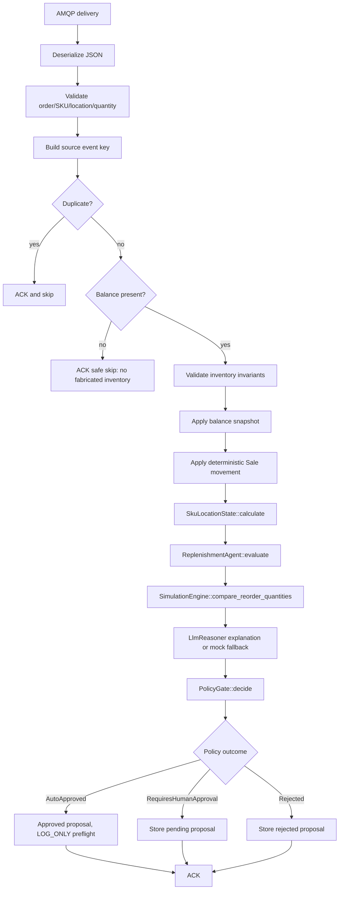

# Hybrid Orchestrator Walkthrough

This document explains the hybrid orchestrator as it exists after hardening. It is written to be honest: this crate is now a safer bridge, but it is not yet the authoritative restock executor.
This document provides a code-level walkthrough of the `hybrid-orchestrator` crate, explaining how it evolved into an autonomous LLM-driven decision core with deterministic tool calling and governance.

## Mental model
---

## 1. Mental Model of the Runtime Pipeline

```text
RabbitMQ event
RabbitMQ Ingress Event (OrderStockConfirmedIntegrationEvent)
    ↓
validate payload
Payload Invariant Validation (0 <= reserved <= on_hand <= max_stock)
    ↓
require balance snapshot
Authoritative Balance Snapshot Verification (Refuse to fabricate stock)
    ↓
feature-engine calculates demand/forecast features
feature-engine: Calculate sliding-window demand features (5m, 15m, 1h, EWMA)
    ↓
replenishment-agent creates deterministic reorder decision
llm_client: propose_with_tools() (Autonomous Multi-Turn Tool Calling)
    ├── Tool 1: get_inventory_snapshot
    ├── Tool 2: get_demand_features
    ├── Tool 3: get_demand_forecast
    ├── Tool 4: get_event_calendar (MANDATORY: Festivals & Promotions)
    ├── Tool 5: get_supplier_signals (MANDATORY: Freight & Port Disruptions)
    ├── Tool 6: simulate_reorder (Grid-search capacity simulation)
    ├── Tool 7: get_historical_sales (ClickHouse daily movements)
    └── Tool 8: run_statistical_analysis (Pure Rust numerical math)
    ↓
simulation engine compares candidate quantities
Rust-Side Continuation Guard: Verify get_event_calendar & get_supplier_signals
    ↓
LLM reasoner explains only; it does not decide
SafetyFirewall: Deterministic Post-Processing
    ├── Capacity clamping: qty <= max(0, max_stock - on_hand)
    ├── Budget clamping: qty <= 5,000
    └── Deterministic Stockout Governance: on_hand <= 0 elevates LOW risk to MEDIUM
    ↓
PolicyGate decides auto / human / reject
PolicyGate: Rule-Based Governance Classification
    ├── Low Risk -> AutoApproved (LOG_ONLY preflight)
    ├── Medium / High Risk -> RequiresHumanApproval (Held for Boss Desk)
    └── Zero Qty / Non-Reorder -> Rejected
    ↓
proposal is stored in memory
ProposalRecord Stored in AppState
    ↓
HTTP Boss Desk can inspect and approve
    ↓
LOG_ONLY command preview is returned
Axum HTTP API (:5005): Boss Desk Operator Review & Approval
```

---

## Architecture diagram
## 2. Key Code Modules & Responsibilities

```mermaid
flowchart TB
    subgraph External[External systems]
        Producer[Ordering / event producer]
        Rabbit[(RabbitMQ)]
        Human[Human operator]
    end
| File | Primary Responsibility |
| :--- | :--- |
| [`src/main.rs`](src/main.rs) | Boots the Axum HTTP server on port `5005`, initializes `AppState`, binds RabbitMQ consumer, and coordinates graceful OS signal handling (`tokio::select!`). |
| [`src/config.rs`](src/config.rs) | Multi-provider resolution (`groq`, `gemini`, `openai`, `disabled`), model aliasing, timeout/round parameters, and `default_system_prompt()`. |
| [`src/llm_tools.rs`](src/llm_tools.rs) | Compacted OpenAI-compatible tool schemas (808 prompt tokens), `execute_tool()` router, ClickHouse queries, and `ToolLoopGuard`. |
| [`src/llm_client.rs`](src/llm_client.rs) | Multi-turn tool execution loop, mandatory domain tool continuation guard, Google/Groq retry delay parser, adaptive backoff, and circuit breaker. |
| [`src/safety_firewall.rs`](src/safety_firewall.rs) | Deterministic post-LLM validation: capacity clamping, budget limits, action normalization (`RESTOCK` synonym), and stockout risk elevation. |
| [`src/state.rs`](src/state.rs) | Thread-safe partitioned `AppState` (`Arc<Mutex<T>>` buckets), ClickHouse warehouse client, and proposal lifecycle management. |
| [`src/event_handler.rs`](src/event_handler.rs) | AMQP consumer loop, payload validation, feature calculation delegation, and `PolicyGate` outcome routing. |

    subgraph Hybrid[hybrid-orchestrator]
        Main[main.rs]
        Handler[event_handler.rs]
        State[state.rs / AppState]
        Api[Axum Boss Desk API]
    end
---

    subgraph Platform[Existing RustDataPlatform crates]
        Feature[feature-engine]
        Agent[replenishment-agent]
        Policy[PolicyGate]
        Sim[SimulationEngine]
    end
## 3. What Was Changed & Why

    Producer --> Rabbit
    Rabbit --> Handler
    Main --> Handler
    Main --> Api
    Handler --> State
    Api --> State
    Handler --> Feature
    Handler --> Agent
    Agent --> Sim
    Agent --> Policy
    Human --> Api
```
1. **Autonomous Tool Calling Replacing Static Formulas:**
   - Previous versions used hardcoded formulas or advisory LLM explanations where the LLM had no data-query capabilities.
   - The current engine gives the LLM 8 deterministic tools. The LLM autonomously inspects real-time demand, forecasts, festival calendars, and supplier disruptions to decide replenishment actions.
2. **Mandatory Domain Tool Enforcement:**
   - Small models (20b/Qwen) occasionally exited early after querying demand forecasts, skipping Indian festive calendars and supplier disruption signals.
   - The Rust tool loop now inspects `tools_used`. If `get_event_calendar` or `get_supplier_signals` was skipped, the loop prompts the model to query them before synthesizing the final decision.
3. **Deterministic Stockout Governance in Safety Firewall:**
   - When inventory is completely depleted (`on_hand: 0`), classifying the decision as `LOW` risk would trigger `AUTO_APPROVED`, silently ordering stock without human review.
   - The firewall elevates `LOW` risk to `MEDIUM` on active stockouts, guaranteeing that `PolicyGate` routes the proposal to `RequiresHumanApproval`.
4. **Token Compaction & Rate Limit Hardening:**
   - Compacted tool definitions by 60% (from ~2,000 to 808 prompt tokens) to fit within Groq's 8,000 TPM limit.
   - Built custom `parse_retry_delay` extracting Google AI Studio and Groq backoff timings directly from JSON error bodies and HTTP headers.

## Runtime flow diagram
---


## 4. Test Verification Checkpoint

For the longer sequence/state diagrams, see [ARCHITECTURE.md](ARCHITECTURE.md).

## What changed from the Gemini draft

### Removed unsafe stock fabrication

Old behavior:

```rust
let on_hand_after = (50_i32 - event.quantity_depleted).max(0);
```

That was not production-safe. It made up inventory state from an arbitrary number.

New behavior:

- The event must include a `balance` snapshot.
- If no balance exists, the event is skipped and counted.
- If balance invariants fail, processing fails safely.

### Added typed application state

`state.rs` now owns:

- `OrchestratorConfig`
- `ExecutionMode`
- `ProposalRecord`
- `OrchestratorMetrics`
- `AppState`

This is cleaner than passing a naked `Arc<Mutex<HashMap<Uuid, ReorderProposal>>>` everywhere.

### Added explicit execution mode

Only `LOG_ONLY` exists today. That is intentional.

Approval now means:

> Human accepted this proposal, and the service prepared a command preview.

It does not mean:

> Stock was restocked.

That honesty matters because Inventory.API remains the sole stock owner.

### Added idempotency

Each event gets a source key:

- use `eventId` if present
- otherwise use `orderId:skuId:locationCode:quantityDepleted`

The process keeps an in-memory `HashSet` of source keys. Duplicate deliveries are acked and skipped.

This is good enough for local/dev, but production still needs durable inbox storage.

### Added health and review API

Routes:

```text
GET  /health
GET  /api/v1/proposals
GET  /api/v1/proposals/{proposal_id}
POST /api/v1/proposals/{proposal_id}/approve
```

These endpoints make the bridge inspectable instead of relying on logs only.

## File-by-file explanation

### `Cargo.toml`

Added:

```toml
tracing-subscriber.workspace = true
thiserror.workspace = true
```

`tracing-subscriber` is required because `main.rs` initializes structured logging. `thiserror` is available for future typed errors; the crate currently uses `anyhow` for bridge-level error propagation.

### `src/main.rs`

Responsibilities:

1. initialize logging
2. load config from environment
3. build shared `AppState`
4. start Axum HTTP API
5. start RabbitMQ consumer task
6. shut down on Ctrl-C

Important details:

- `/health` returns current metrics.
- proposal routes expose the in-memory proposal records.
- approval is conflict-safe: approving an already-approved/rejected proposal returns `409`.
- approval returns a command preview, not a fake execution success.

### `src/state.rs`

Responsibilities:

- centralize runtime config
- hold proposal records
- hold in-process duplicate event keys
- hold metrics
- implement proposal approval state transition

Important structs:

- `OrchestratorConfig`: environment-derived settings.
- `ExecutionMode`: currently only `LOG_ONLY`.
- `ProposalRecord`: audit object joining proposal, decision, simulation, policy, balance, and status.
- `OrchestratorMetrics`: operational counters.
- `AppState`: cloned into Axum and AMQP tasks.

### `src/event_handler.rs`

Responsibilities:

1. connect to RabbitMQ
2. declare/consume the configured queue
3. parse and validate events
4. deduplicate events
5. calculate features using `SkuLocationState`
6. evaluate with `ReplenishmentAgent`
7. simulate with `SimulationEngine`
8. explain with LLM fallback
9. govern with `PolicyGate`
10. store proposal record

Important safety rules:

- malformed JSON is nacked with `requeue=false`
- invalid balance invariants stop processing
- missing balance does not create fake features
- non-authoritative balance becomes `UNRECONCILED`
- `UNRECONCILED` data requires human approval through the existing policy gate
- LLM failure falls back to deterministic explanation

## Runtime flow in plain English

1. RabbitMQ delivers an event saying an order consumed inventory.
2. The orchestrator checks that the event has real SKU, location, quantity, and balance data.
3. It converts the balance into `InventoryBalanceState`.
4. It converts the order consumption into a deterministic Sale movement fact.
5. The feature engine computes rolling sales windows and adaptive forecast values.
6. The replenishment agent decides whether more stock is needed.
7. The simulator tests several quantities against capacity.
8. The LLM writes an explanation, but cannot approve or execute anything.
9. The policy gate decides whether this is auto-safe, human-required, or rejected.
10. The proposal record is stored in memory for the HTTP API.
11. A human can inspect and approve it.
12. Approval returns a command preview only.

## Verification performed

```bash
cd src/RustDataPlatform
cd /home/cleaff/eShop/src/RustDataPlatform
cargo fmt --all --check
cargo test -p hybrid-orchestrator
cargo clippy -p hybrid-orchestrator --all-targets -- -D warnings
cargo test --workspace
cargo clippy --workspace -- -D warnings
```

Result:

- formatting passed
- 4 focused tests passed
- Clippy passed with warnings denied

## Remaining work before production execution

This bridge is much better now, but these are still required before it can mutate stock:

1. Persist proposals and inbox entries in PostgreSQL governance tables.
2. Add authentication and authorization to approval endpoints.
3. Add a real command publisher or Inventory.API executor client.
4. Persist execution attempts before calling Inventory.
5. Add retry/DLQ topology and operational alarms.
6. Add integration tests using real RabbitMQ payloads from Ordering/Inventory.
7. Add OpenTelemetry metrics/traces.
8. Wire through Aspire only after the queue contract is finalized.


## Production hardening changes

### `src/config.rs`

This file centralizes environment configuration. The service now reads RabbitMQ from `AMQP_URL` or Aspire's `ConnectionStrings__eventbus`, so it no longer depends on a hardcoded local port. It also selects the LLM provider:

1. Groq when `GROQ_API_KEY` exists.
2. OpenAI when `OPENAI_API_KEY` exists.
3. deterministic fallback when neither exists.

### `src/llm_client.rs`

This file is the live Strategy Officer client. It sends OpenAI-compatible chat-completions requests to Groq/OpenAI with strict JSON schema output. It returns a typed `LlmActionProposal` and validates basic shape before the policy layer sees it.

Failure behavior is intentionally conservative:

- HTTP 429, timeout, HTTP 5xx, malformed JSON, or circuit-open state falls back to deterministic reasoning.
- The AMQP consumer is not blocked indefinitely because the client timeout defaults to 3.5 seconds.
- Hybrid hard limits reject rogue LLM outputs such as excessive reorder quantity or markdown.

### `src/event_handler.rs`

The handler now keeps rolling feature state in `AppState` instead of creating a fresh `SkuLocationState` for every event. That means 5m/15m/1h velocity can accumulate across events in the process.

The AMQP connection now uses exponential backoff and reconnects after disconnects. Acknowledgement behavior is explicit:

- `ack` on success/duplicate.
- `nack(requeue=false)` for poison pills.
- `nack(requeue=true)` for transient platform failures.

### `src/state.rs`

State now includes proposal TTL cleanup, audit records, AMQP readiness, LLM status, rolling feature states, and metrics for LLM fallback/policy rejection/reconnects.

### Required verification

```bash
cd src/RustDataPlatform
cargo test -p hybrid-orchestrator
cargo clippy -p hybrid-orchestrator --all-targets -- -D warnings
```

Current result after hardening: 8 tests passed, including:

- LLM JSON schema parser test.
- Circuit breaker fallback test when provider is unavailable.
- Policy boundary rejection test for exaggerated LLM order quantity.
- **66 tests pass** across the entire workspace (31 in `hybrid-orchestrator`).
- Zero formatting diffs and zero Clippy warnings.
