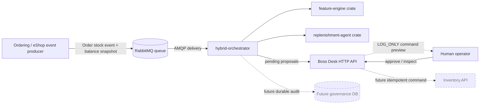
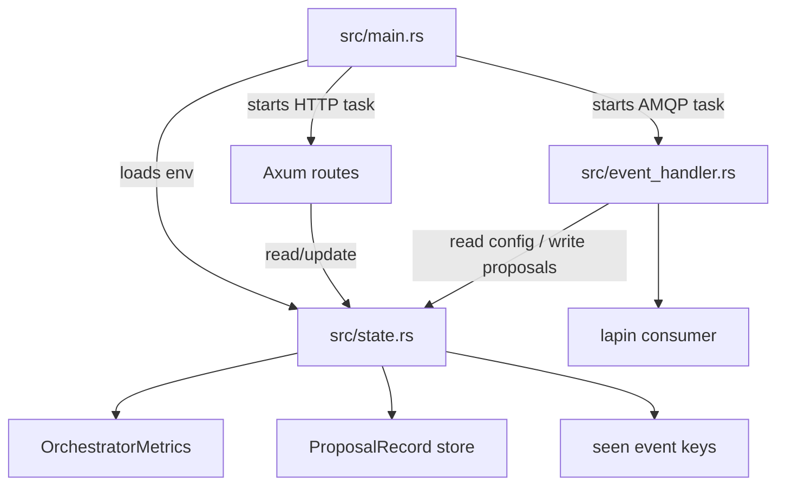
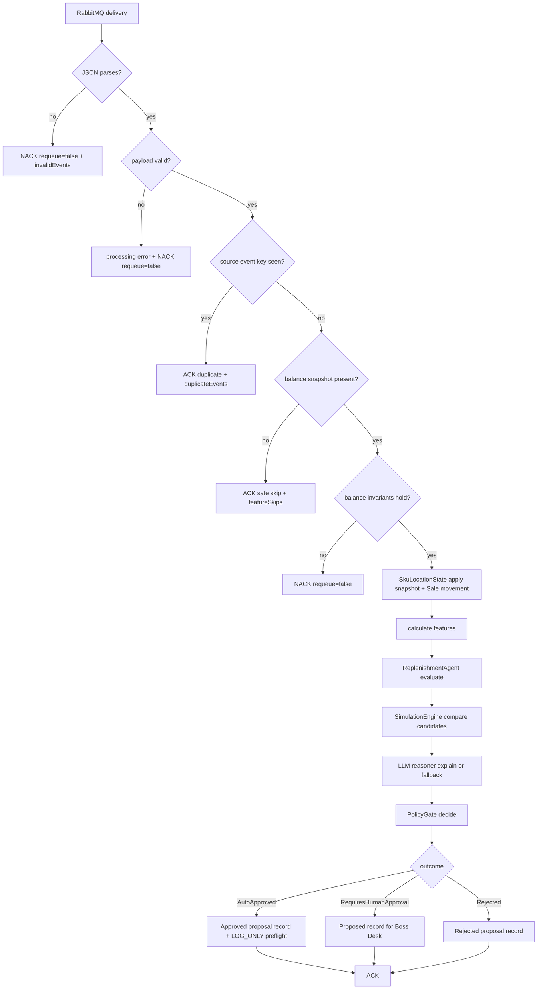
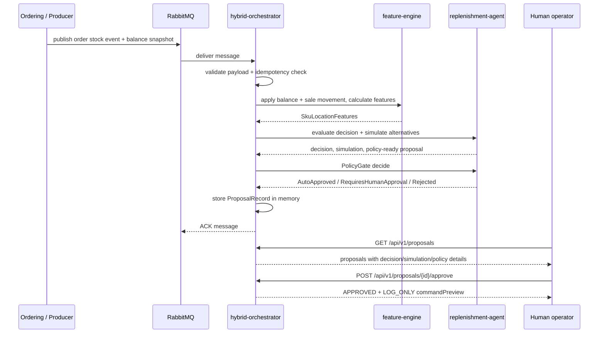
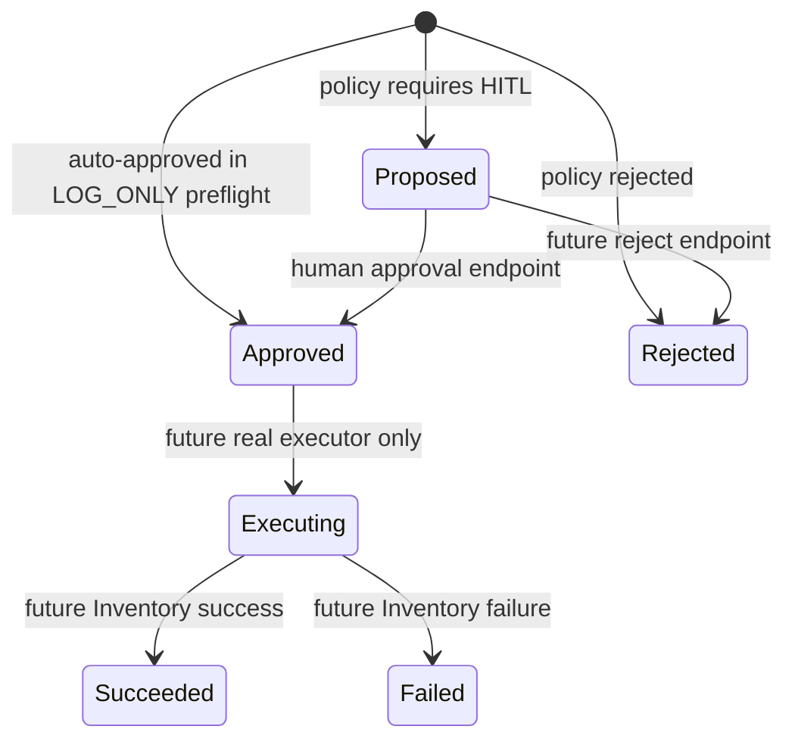
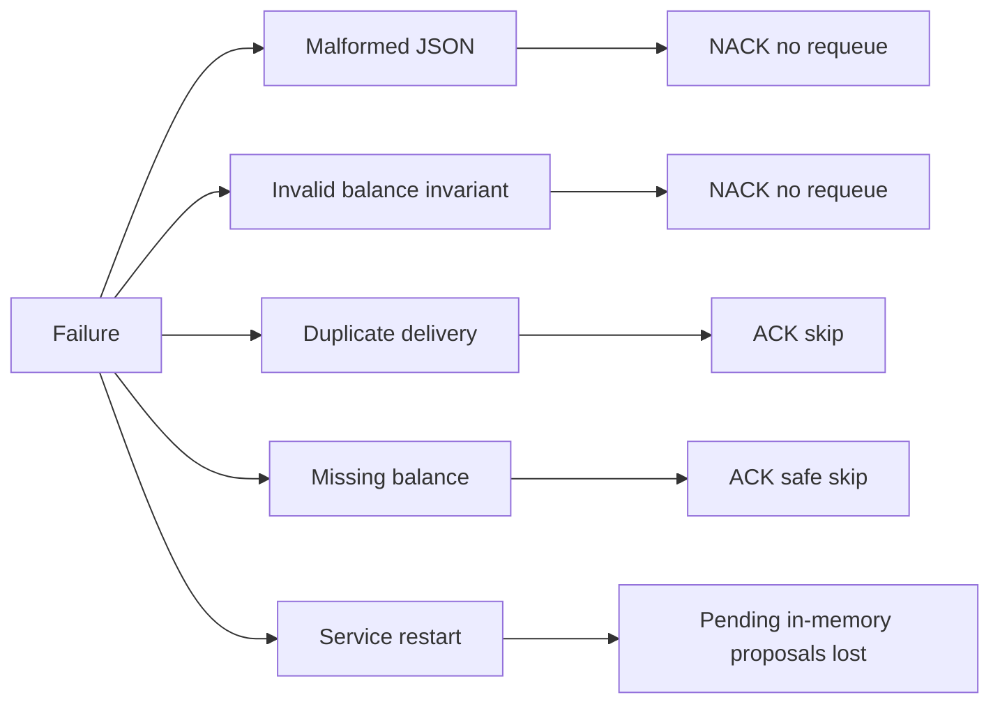
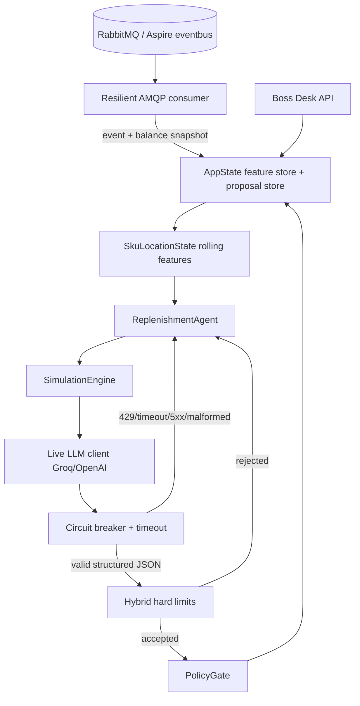
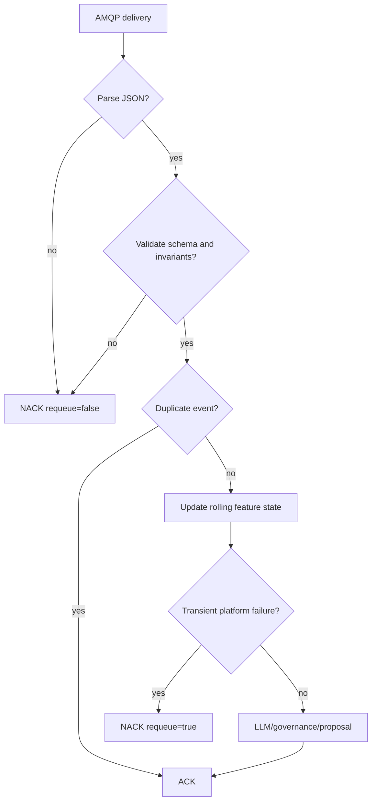

# Hybrid Orchestrator Architecture

This document explains the hybrid orchestrator from a system-design point of view. It focuses on boundaries, runtime flow, safety gates, failure behavior, and what must change before the service can execute real restocks.

## 1. System context



Key point: Inventory remains the only service allowed to own stock. The current orchestrator only prepares proposals and command previews.

## 2. Internal module architecture



The important refactor is that shared state is no longer a naked `Arc<Mutex<HashMap>>`. It is a typed `AppState` with named responsibilities.

## 3. Event-processing flow



Why this matters: bad data is rejected, missing stock state is not invented, duplicate deliveries are absorbed, and execution never happens behind the human's back.

## 4. Human-in-the-loop sequence



The LLM is not shown as an actor with system access because it does not get system access. It only receives deterministic decision/simulation context and returns explanation text.

## 5. Proposal state machine



Current implementation reaches `Proposed`, `Approved`, or `Rejected`. `Executing`, `Succeeded`, and `Failed` are future real-executor states.

## 6. Data contracts

### Incoming event

```json
{
  "eventId": "d94bc7e4-1e8a-4a3e-a596-c633e0a17eb1",
  "orderId": 1001,
  "skuId": 42,
  "locationCode": "NCR",
  "quantityDepleted": 8,
  "occurredAt": "2026-09-17T08:30:00Z",
  "balance": {
    "onHand": 12,
    "reserved": 0,
    "safetyStock": 10,
    "reorderPoint": 30,
    "maxStock": 100,
    "version": 9,
    "updatedAt": "2026-09-17T08:30:01Z",
    "authoritative": true
  }
}
```

### Stored proposal record

A `ProposalRecord` combines:

- proposal identity and status
- deterministic reorder decision
- simulation alternatives
- policy decision
- balance snapshot used for the decision
- data freshness status
- source event key
- execution attempts list
- human-readable message

This makes the approval API explainable. A user can see why a proposal exists before approving it.

## 7. Safety boundaries

| Boundary | Current behavior |
|---|---|
| Inventory state | Must arrive as balance snapshot; never guessed |
| LLM | Explanation only; no tools, DB, HTTP, shell, or queue access |
| Policy | Deterministic `PolicyGate` owns approval outcome |
| Execution | `LOG_ONLY`; no Inventory mutation |
| Idempotency | In-process event-key set; durable inbox still required |
| Approval storage | In-memory proposal store; durable governance DB still required |
| Bad messages | malformed JSON and invariant failures are nacked with `requeue=false` |

## 8. Failure and recovery model



Production hardening priority: replace in-memory proposal/idempotency state with durable governance tables before any real execution is enabled.

## 9. Production-readiness checklist

Before enabling real stock mutation:

- [ ] durable proposal table
- [ ] durable incoming-event inbox table
- [ ] durable execution-attempt table
- [ ] DLQ topology and replay tooling
- [ ] authenticated approval endpoint
- [ ] authorized roles for approve/reject
- [ ] real Inventory command publisher or Inventory API client
- [ ] idempotent operation ID persisted before execution
- [ ] OpenTelemetry metrics/traces
- [ ] integration test with RabbitMQ + Inventory.API
- [ ] Aspire registration and health checks
- [ ] security review of event payload and approval API


## 10. Production hardening architecture



The LLM is deliberately boxed in:

1. It receives only deterministic decision/simulation/balance context.
2. It must return `propose_action` JSON matching the schema.
3. Its HTTP call has a 3.5s timeout.
4. Rate limits/timeouts/errors open the circuit breaker and use deterministic fallback.
5. Hybrid hard limits reject rogue quantities/markdowns.
6. `PolicyGate` still decides whether a proposal can be auto-approved, rejected, or routed to HITL.

## 11. Message acknowledgement model



Poison pills do not loop forever. Transient platform failures are requeued.

## 12. Runtime state

`AppState` now contains:

- typed config loaded from environment
- `LlmClient` with provider/circuit state
- in-process idempotency keys
- rolling `SkuLocationState` feature store per SKU/location
- proposal records with TTL
- audit events
- health/readiness fields
- operational metrics

The in-memory proposal/idempotency stores are production-shaped but not production-durable yet. Before real execution mode is enabled, move them to governance PostgreSQL tables.
