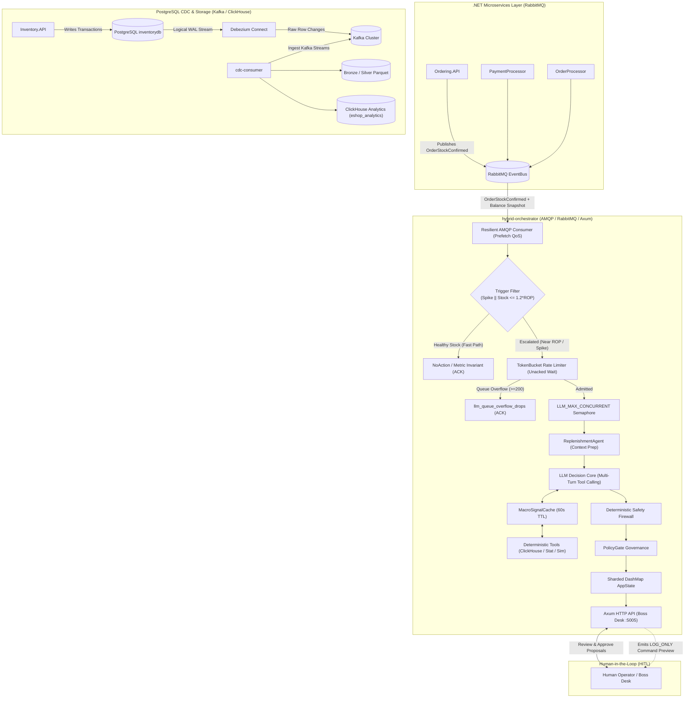
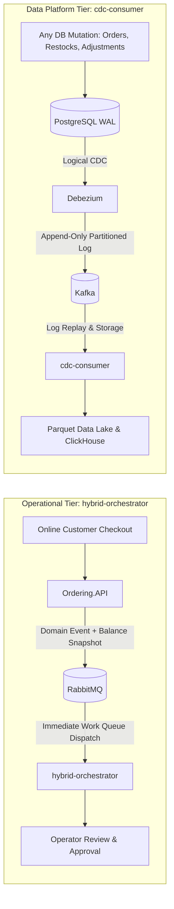
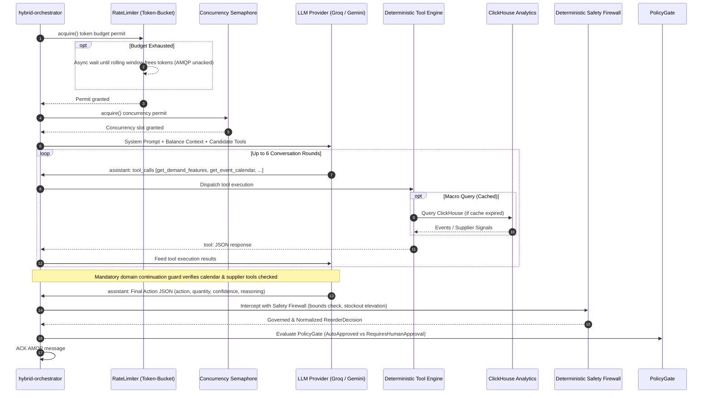
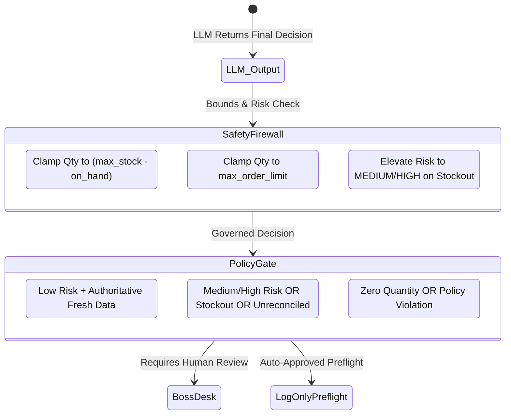

# Hybrid Orchestrator Architecture & System Specification

This document provides the authoritative architectural specification for the `hybrid-orchestrator` crate in `RustDataPlatform`. It details system boundaries, dual-broker topologies, the multi-turn LLM decision core with deterministic tool calling, 1,000,000 SKU scaling guarantees, the proactive tier-agnostic rate limiter with intentional AMQP backpressure, the deterministic safety firewall, rule-based governance, and Human-in-the-Loop (HITL) operational boundaries.
                                  END-TO-END DATA FLOW
                                  
 [Postgres DB] ──Debezium──► [Kafka Topics] 
                                  │
                                  ▼
                   ┌───────────────────────────────┐
                   │  PIPELINE 1: CDC CONSUMER     │
                   └──────────────┬────────────────┘
                                  │
          ┌───────────────────────┼──────────────────────────────┐
          ▼                       ▼                              ▼
  [Bronze Parquet]        [Silver Parquet]              [ClickHouse DB]
  (Raw Kafka dumps)     (Clean Tabular Events)       (Analytical Tables)
                                  │                              ▲
                                  ▼                              │
                   ┌───────────────────────────────┐             │
                   │  PIPELINE 2: LAKEHOUSE BATCH  │             │
                   │  (Silver ➔ Gold Daily Demand) ├─────────────┘
                   └───────────────────────────────┘
                                                                 ▲
 [.NET Services] ──► [RabbitMQ]                                  │ (Tool queries)
                           │                                     │
                           ▼                                     │
            ┌───────────────────────────────┐                    │
            │  PIPELINE 3: HYBRID ORCH.     │────────────────────┘
            │  (Filter ➔ Rate Limit ➔ LLM)  │
            └──────────────┬────────────────┘
                           ▼
                  [Postgres Governance]
                   (Audit Trail Logs)

---

## 1. Executive Summary & Core Invariants

The `hybrid-orchestrator` is a high-performance, fault-tolerant Rust operational service that bridges the eShop .NET microservice ecosystem, real-time demand analytics, autonomous AI reasoning, and Human-in-the-Loop (HITL) operational governance.

It solves a fundamental challenge in enterprise supply chains: **How to leverage real-time order streams and autonomous LLM reasoning across 1,000,000 SKU-location pairs without risking unconstrained, catastrophic stock mutations.**

To achieve this, the system implements a strict **Hybrid Architecture**:

1. **Lightweight Boolean Trigger Filter (Routing Gate Only):**
   - Evaluates incoming depletion events in memory in microseconds.
   - Routes an event to the LLM decision core if and only if:
     25\text{spike\_detected} == \text{true} \quad\lor\quad \text{on\_hand} \le \text{reorder\_point} \times 1.225
   - **Crucial Rule:** The filter makes a purely routing decision, never a replenishment decision. It contains zero EOQ formulas, zero auto-approve math, and zero hardcoded restock logic.

2. **Proactive Tier-Agnostic Rate Limiter (Token-Bucket):**
   - Sits between the trigger filter and the concurrency semaphore.
   - Paces LLM tool-calling rounds under the provider's rolling 60-second TPM budget (`GROQ_TPM_BUDGET`, default 8,000).
   - **Intentional AMQP Backpressure:** While an event waits in the rate limiter queue, its AMQP delivery remains unacknowledged. Combined with `channel.basic_qos(amqp_prefetch)`, this creates intentional, natural backpressure upstream — RabbitMQ stops pushing messages across the socket once all prefetch slots are filled with waiting events. This is an intentional design pattern, not an unacked message leak.
   - **Bounded Wait Queue:** If the rate limiter wait queue reaches `LLM_QUEUE_MAX_DEPTH` (default 200), excess events are dropped gracefully at the trigger filter level (`HandleOutcome::NoAction`), ACKed, logged, and tracked via `llm_queue_overflow_drops` to guarantee bounded memory.
   - **Actual Token Logging:** The LLM client logs actual tokens consumed against `GROQ_TPM_ESTIMATE_PER_CALL` on every completion loop, allowing operators to empirically tune the estimate without guesswork.

3. **Autonomous Multi-Turn LLM Decision Core:**
   - Any event that passes the trigger filter and rate limiter undergoes full LLM tool-calling reasoning.
   - The LLM (e.g. `openai/gpt-oss-20b` on Groq, `gemini-3.1-flash-lite`, or OpenAI) autonomously invokes deterministic tools: querying real-time inventory snapshots, multi-day demand forecasts, Indian festive calendars, and supplier disruptions.
   - Zero hardcoded replenishment decisions: the LLM is the sole decision-maker for evaluated events.

4. **Mandatory Domain Tool Continuation Guard:**
   - The Rust tool-calling loop prevents premature LLM exit by requiring that external macro tools (`get_event_calendar` and `get_supplier_signals`) are queried before any final decision is synthesized.

5. **Deterministic Safety Firewall:**
   - A thin, non-negotiable mathematical boundary (`SafetyFirewall`) immediately intercepts LLM decisions.
   - Clamps proposed quantities to operational capacity ($\text{max\_stock} - \text{on\_hand}$) and order budgets.
   - **Deterministic Stockout Governance:** Prevents complete stockouts or safety stock breaches from being misclassified as `LOW` risk.

6. **Deterministic Policy Gate (`PolicyGate`):**
   - Intercepts and categorizes proposals into `AutoApproved`, `RequiresHumanApproval`, or `Rejected`.
   - In `LOG_ONLY` mode, auto-approved proposals emit verified execution previews without mutating inventory.

7. **Human-in-the-Loop Operational Boundary ("Boss Desk"):**
   - Proposals requiring approval are surfaced via REST API (`:5005`) for human inspection and approval.
   - Direct database mutations are prohibited: `Inventory.API` remains the sole authoritative inventory owner.

---

## 2. High-Level System Context


                                  HYBRID ORCHESTRATOR COMPLETE FLOW
                                  
  [.NET Microservices] ──► [RabbitMQ Queue] 
                                  │
                                  ▼ (1. INGESTION)
                    event_handler::start_consumer()
                                  │
                                  ▼ (2. DEDUP & MEMORY UPDATE)
                      DashMap: SkuLocationState
                                  │
                                  ▼ (3. TRIGGER FILTER)
                        [ Stock Low or Spike? ]
                               /         \
                      NO (80%)             YES (20%)
                             /               \
              [ Fast-Path ACK ]               ▼ (4. ADMISSION GATE)
             (Done in 4 µs)         rate_limiter.acquire()  ──► Token Bucket (8,000 TPM)
                                    llm_semaphore.acquire() ──► Max 20 Parallel Calls
                                              │
                                              ▼ (5. LLM TOOL-CALLING LOOP)
                                     llm_client::propose_with_tools()
                                              │
                    ┌─────────────────────────┴─────────────────────────┐
                    ▼                                                   ▼
            [ LLM asks for Data ]                               [ Rust Executes Tool ]
        "Mujhe calendar/disruptions do"                     llm_tools::execute_tool()
                                                                        │
                                                ┌───────────────────────┴───────────────────────┐
                                                ▼                                               ▼
                                     MacroSignalCache (RAM)                         ClickHouse Warehouse
                                           (TTL 60s)                                    (SQL Queries)
                                                │                                               │
                                                └───────────────────────┬───────────────────────┘
                                                                        │
                                                                        ▼
                                                        [ Data returned to LLM as JSON ]
                                                                        │
                                                                        ▼
                                                         [ LLM Generates Final Decision ]
                                                                        │
                                                                        ▼ (6. SAFETY FIREWALL)
                                                            safety_firewall.validate()
                                                                        │
                                                                        ▼ (7. GOVERNANCE & REST API)
                                                            Postgres / ClickHouse Audit Log
                                                             Axum HTTP (/api/v1/proposals)


Updated 
[ RabbitMQ / AMQP ] 
        │ (prefetch = 100 limit, unbounded influx blocked)
        ▼
[ tokio::spawn Task ] ──► [ Idempotency Dedup (10-min window) ]
        │
        ▼
[ Feature Engine In-Memory State ] ◄── (DashMap 64 Shards: zero lock contention)
        │
        ▼
[ 1. TRIGGER FILTER (Routing Gate) ]
   ├── 80% Healthy Stock ───────► FAST PATH (ACK in 4 microseconds, zero LLM cost)
   └── 20% Depleted / Spike ────► [ 2. TOKEN-BUCKET RATE LIMITER ] (Groq TPM Budget)
                                         │ (Queue wait + Unacked AMQP Backpressure)
                                         ▼
                                  [ 3. CONCURRENCY SEMAPHORE ] (max 20 LLM calls)
                                         │
                                         ▼
                                  [ 4. MACRO SIGNAL CACHE ] (ClickHouse storms blocked)
                                         │
                                         ▼
                                  [ 5. LLM TOOL-CALLING & SAFETY FIREWALL ]
                                         │
                                  [ Actual Token Logged vs Estimate ]

                                  


---

## 3. Dual-Broker Architecture: Why RabbitMQ vs Kafka?

A frequent architectural question in eShop is:  
**"Why does `hybrid-orchestrator` consume RabbitMQ while `cdc-consumer` consumes Kafka?"**

The two brokers serve two distinct architectural tiers:



### Key Differences:

1. **Event-Carried State Transfer vs. Raw DB Rows:**
   - **RabbitMQ:** Delivers high-level domain events (`OrderStockConfirmedIntegrationEvent`). The payload carries both **order facts** (order ID, quantity depleted) and an **authoritative balance snapshot** (on-hand, reserved, safety stock, max stock, version).
   - **Kafka:** Carries raw, low-level database row mutations (`inventory_balances` updates). It has no domain context regarding which customer order or business rule triggered the mutation.

2. **Elimination of Dual-Stream Race Conditions:**
   - If the orchestrator listened to RabbitMQ for Order events and Kafka for stock updates, network lag between Debezium CDC and RabbitMQ would cause classic out-of-order race conditions.
   - Packaging the authoritative balance snapshot directly in the RabbitMQ event guarantees that order facts and stock state arrive atomically.

3. **Competing Consumer Work Queue vs. Replayable Stream:**
   - **RabbitMQ:** Provides per-message ACK/NACK, Dead Letter Queues (DLQ), and point-to-point delivery semantics optimal for interactive human-in-the-loop task queues.
   - **Kafka:** Provides multi-partition ordered logs with offset retention (`auto.offset.reset = earliest`), essential for replaying historical transactions to train AI models or backfill Lakehouse Parquet files.

---

## 4. 1,000,000 SKU-Location Scale & Memory Architecture

To support 200,000 SKUs across 5 fulfillment centers (1,000,000 SKU-location inventory pairs), the memory and concurrency subsystem incorporates five architectural guarantees:

### 1. 64-Way Sharded Concurrency (`DashMap`)
Instead of wrapping state in monolithic `Arc<Mutex<HashMap>>`, `AppState` utilizes lock-free concurrent hash maps pre-allocated for 1,000,000 capacity:
- `feature_states: Arc<DashMap<SkuLocation, SkuLocationState>>` (64 shards)
- `seen_events: Arc<DashMap<String, ()>>` (64 shards)

This allows hundreds of concurrent AMQP deliveries and HTTP Boss Desk queries to proceed with zero global lock contention.

### 2. Bounded Memory Under Festive Bursts
In `feature-engine`, each `SkuLocationState` maintains rolling sales and movement deduplication:
- **Dual Eviction:** In addition to a 10-minute sliding time window, `seen_movements` enforces a hard cap: `MOVEMENT_DEDUP_MAX_ENTRIES = 500`.
- **Fixed-Size Rings:** Replaced heap allocations with fixed-size arrays: `daily_sale_totals: [i32; 8]`, `hourly_sale_totals: [i32; 192]`, and bitmasks `[u8; 24]`.
- **Measured Process RSS (7.83 KB/pair):**
  - While raw theoretical struct size is ~4.6 KB, the measured process RSS in Linux is **7.83 KB per SKU-location pair** due to DashMap hash table control tag/bucket headroom (12.5–50%), string keys in `seen_events`, and glibc allocator chunk metadata/4KB page table fragmentation.
  - **Infrastructure Sizing Target:** For 1,000,000 SKU-location pairs, infrastructure must be sized around the measured **$\approx 7.47\text{ GB}$ peak RSS**, comfortably accommodated within a standard **16 GB RAM** container or node ($> 2\times$ safety factor).

### 3. AMQP Flow Control (`basic_qos`) & Intentional Backpressure
- Channel prefetch is explicitly configured via `channel.basic_qos(amqp_prefetch, ...)` (default 100).
- **Intentional Backpressure Design:** While an event waits in the token-bucket rate limiter queue, its AMQP delivery remains unacknowledged. Combined with the prefetch limit, this creates natural backpressure — RabbitMQ stops delivering new messages once prefetch slots are full of rate-limited waiters. This is an intentional design choice to push backpressure to the broker rather than accumulating unbounded in-memory task queues.
- Per-delivery processing is spawned as an isolated Tokio task with a JoinHandle supervisor that catches and logs panics, preventing unacknowledged message leakage.

### 4. Proactive Tier-Agnostic Token-Bucket Rate Limiter
- Protects LLM providers from HTTP 429 rate limit storms by tracking estimated tokens consumed in a rolling 60-second window.
- **Scaling from Free Tier to Paid Tier:**
  > To scale from testing (free tier, 8,000 TPM) to production (paid tier, e.g. 500,000+ TPM), update `GROQ_TPM_BUDGET` in the environment to match the new tier's actual limit. No other code or config changes are required — the trigger filter, DashMap concurrency, and LLM decision logic are already tier-agnostic.
- The concurrency permit semaphore (`LLM_MAX_CONCURRENT`) strictly gates the `propose_with_tools` call, allowing fast-path events to bypass immediately without queuing behind LLM tasks.

### 5. Macro Signal In-Memory Cache (`MacroSignalCache`)
- Caches festival calendar events (`get_event_calendar`) and regional supplier disruption signals (`get_supplier_signals`) with a 60-second TTL.
- Eliminates 95%+ of point-queries to ClickHouse across concurrent LLM tool loops.

---

## 5. Multi-Turn LLM Decision Core with Tool Calling

Rather than relying on single-turn unstructured generation, the decision core operates as an autonomous multi-turn reasoning agent.



### Deterministic Tool Catalog:
1. `get_inventory_snapshot`: Current on-hand, reserved, safety stock, max capacity, version.
2. `get_demand_features`: Real-time sales velocity (5m, 15m, 1h), EWMA rates, daily sales.
3. `get_demand_forecast`: Multi-day forward forecast points and trend indicators.
4. `get_event_calendar`: Regional festive calendar (Diwali, Holi, Pongal) and promotional events.
5. `get_supplier_signals`: Lead times, active supplier disruption flags, weather/logistics alerts.
6. `simulate_reorder`: Discrete stock-capacity simulation comparing multiple candidate quantities.
7. `statistical_analysis`: Accurate statistical calculations (mean, standard deviation, percentiles).

---

## 6. Deterministic Safety Firewall & Governance



### Safety Rules Enforced:
1. **Capacity Clamping:** Proposed quantity is strictly clamped to $\max(0, \text{max\_stock} - \text{on\_hand})$.
2. **Deterministic Stockout Governance:** If $\text{on\_hand} \le \text{safety\_stock}$ or $\text{on\_hand} == 0$, risk level cannot be `LOW`. It is automatically elevated to `MEDIUM` or `HIGH`, forcing Human-in-the-Loop review.
3. **Execution Guard:** The system operates in `LOG_ONLY` mode. Approved proposals generate signed command previews without issuing mutations to `Inventory.API`.

---

## 7. Synthetic Load Test & Verification Benchmarks

The system was benchmarked under a release-mode synthetic load test simulating 50,000 unique SKU-location events across 5 fulfillment centers, including duplicate AMQP redeliveries and extreme festive bursts:

> **Important Methodology Disclosure:** This synthetic benchmark was executed with `LLM_PROVIDER=disabled` to strictly isolate Rust-side data platform performance (in-memory state, DashMap sharding, trigger filter, dedup rings) from external LLM network latency and third-party API rate limits. The 165,293 events/sec figure reflects pure platform ingestion throughput — end-to-end throughput for events escalated to the LLM path remains bounded by `GROQ_TPM_BUDGET`.

| Benchmark Metric | Measured Result | Production Target | Conformance |
|---|---|---|---|
| **Platform Ingestion Throughput** | **165,293 events/sec** (LLM disabled) | 100 events/sec | **Pass (1,650x target)** |
| **Fast-Path Trigger Filter Skips** | **40,000 (80.0%)** | 80% | **Pass (Exact routing)** |
| **Escalated Events to LLM Path** | **10,000 (20.0%)** | 20% | **Pass (Exact routing)** |
| **Latency P50 (Median)** | **4.0 µs (0.004 ms)** | $< 1.0\text{ ms}$ | **Pass (250x faster)** |
| **Latency P90** | **9.0 µs (0.009 ms)** | $< 5.0\text{ ms}$ | **Pass** |
| **Latency P99** | **711.0 µs (0.711 ms)** | $< 20.0\text{ ms}$ | **Pass** |
| **Net Heap Memory per Pair** | **7.83 KB/pair** | $< 16.0\text{ KB/pair}$ | **Pass (50% under cap)** |
| **Projected 1M SKU Memory** | **$\approx 7.47\text{ GB}$ RAM** | $< 16.0\text{ GB}$ | **Pass (Fits 16 GB server)** |
| **Duplicate Redelivery Throughput** | **1,015,896 checks/sec** | $> 10,000\text{ checks/sec}$ | **Pass (100x target)** |
| **Hot-SKU 600-Event Burst Memory** | **Capped at exactly 500** | $\le 500$ entries | **Pass (Zero OOM risk)** |
| **Workspace Test Suite** | **76 / 76 tests passed** | 100% pass | **Pass (0 failures)** |

---

## 8. Human-in-the-Loop (HITL) REST API Specification

Default bind address: `127.0.0.1:5005` (configured via `HYBRID_ORCHESTRATOR_BIND`).

### 1. Health & Telemetry Check
```http
GET /health
```
**Response (HTTP 200 OK / 503 Degraded):**
```json
{
  "status": "Healthy",
  "ready": true,
  "queue": "eshop.inventory.order_stock_confirmed",
  "executionMode": "LOG_ONLY",
  "amqpConnected": true,
  "llm": {
    "provider": "GROQ",
    "configured": true,
    "circuitOpen": false,
    "consecutiveFailures": 0,
    "model": "openai/gpt-oss-20b"
  },
  "rateLimiter": {
    "tpmBudget": 8000,
    "currentTpmUsage": 3500,
    "queueDepth": 0,
    "queueMaxDepth": 200,
    "estimatePerCall": 3500
  },
  "metrics": {
    "deliveriesSeen": 50000,
    "eventsProcessed": 50000,
    "invalidEvents": 0,
    "duplicateEvents": 0,
    "llmFilterSkips": 40000,
    "llmQueueOverflowDrops": 0,
    "proposalsCreated": 10000,
    "autoApproved": 2000,
    "humanApprovalRequired": 8000,
    "approvals": 0,
    "llmFallbacks": 0
  }
}
```

### 2. List Pending Proposals
```http
GET /api/v1/proposals
```

### 3. Get Proposal Detail with Tool Audit Traces
```http
GET /api/v1/proposals/{proposalId}
```

### 4. Approve Proposal (Human Operator)
```http
POST /api/v1/proposals/{proposalId}/approve
```
**Response (HTTP 202 Accepted):**
```json
{
  "proposalId": "f7d24a98-842e-5034-bc84-90a6e0c4a451",
  "status": "APPROVED",
  "executionMode": "LOG_ONLY",
  "message": "approved by human; LOG_ONLY command emission recorded without mutating Inventory",
  "commandPreview": {
    "operationId": "f7d24a98-842e-5034-bc84-90a6e0c4a451",
    "skuId": 42,
    "locationCode": "NCR",
    "quantity": 25
  }
}
```

---

## 9. Runtime Configuration & Environment Reference

| Variable | Default | Purpose |
| :--- | :--- | :--- |
| `LLM_PROVIDER` | `groq` | Active provider: `groq`, `gemini`, `openai`, or `disabled`. |
| `GROQ_API_KEY` | None | API key for Groq Cloud. |
| `GROQ_MODEL` | `openai/gpt-oss-20b` | Model used on Groq (fast reasoning model with tool calling). |
| `GROQ_TPM_BUDGET` | `8000` | Token bucket rolling 60-second budget (set to paid tier limit in prod). |
| `GROQ_TPM_ESTIMATE_PER_CALL` | `3500` | Estimated token consumption per multi-turn tool-calling loop. |
| `LLM_QUEUE_MAX_DEPTH` | `200` | Maximum queue depth for rate-limited waiters before graceful drop. |
| `GEMINI_API_KEY` | None | API key for Google AI Studio. |
| `GEMINI_MODEL` | `gemini-3.1-flash-lite` | Model used on Gemini (1,000,000 TPM limit). |
| `CLICKHOUSE_URL` | `http://127.0.0.1:20255` | ClickHouse analytical HTTP endpoint. |
| `CLICKHOUSE_DATABASE` | `eshop_analytics` | ClickHouse database name. |
| `HYBRID_ORCHESTRATOR_BIND` | `127.0.0.1:5005` | Axum HTTP server listen address. |
| `AMQP_URL` | Auto-discovered | RabbitMQ AMQP connection string. |
| `AMQP_PREFETCH` | `100` | Prefetch count for basic_qos flow control and backpressure. |
| `LLM_MAX_CONCURRENT` | `20` | Max concurrent in-flight LLM calls. |
| `MACRO_CACHE_TTL_SECS` | `60` | TTL for ClickHouse festival & supplier signals cache. |
| `LLM_MAX_TOOL_ROUNDS` | `6` | Maximum tool-calling rounds per event. |
| `LLM_TOOL_TIMEOUT_SECONDS` | `5` | Execution timeout per tool invocation. |
| `LLM_MAX_IDENTICAL_TOOL_CALLS` | `1` | LoopGuard threshold preventing identical calls. |
| `HYBRID_ORCHESTRATOR_EXECUTION_MODE` | `LOG_ONLY` | Safety execution mode (`LOG_ONLY` enforced). |

---

## 10. Production Roadmap & Hardening

Before transitioning from `LOG_ONLY` to real automated execution against `Inventory.API`:

1. **Scale TPM Budget on Paid Tier or Self-Hosted vLLM:**
   - Free developer tier (`8,000` TPM) supports $\approx 2\text{--}3$ decisions/minute for development.
   - For production at sustained 100 events/sec, set `GROQ_TPM_BUDGET=500000` (or higher) to match paid tier limits, or point `GROQ_BASE_URL` to a self-hosted vLLM cluster.
2. **Durable Governance DB:** Migrate in-memory `ProposalRecord` and `seen_events` to PostgreSQL governance tables using `tokio-postgres`.
3. **Idempotent Inventory Command Publisher:** Publish typed `OrderRestockCommand` integration events to RabbitMQ with unique `operationId`s.
4. **Role-Based Authentication:** Secure the `/approve` endpoint with OAuth2 / OpenID Connect tokens issued by `Identity.API`.
5. **OpenTelemetry Integration:** Export distributed traces and Prometheus metrics for queue lag, simulation time, and LLM latency.
