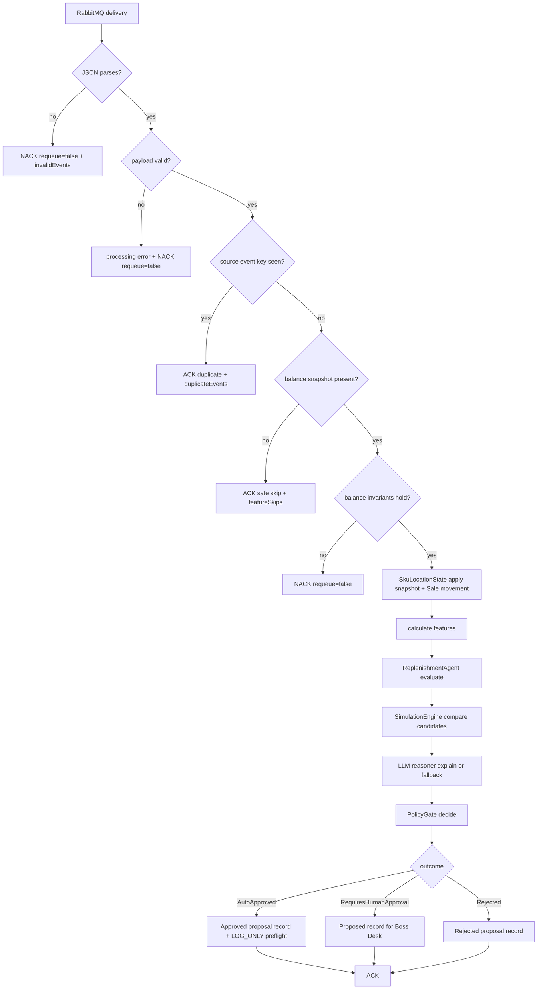
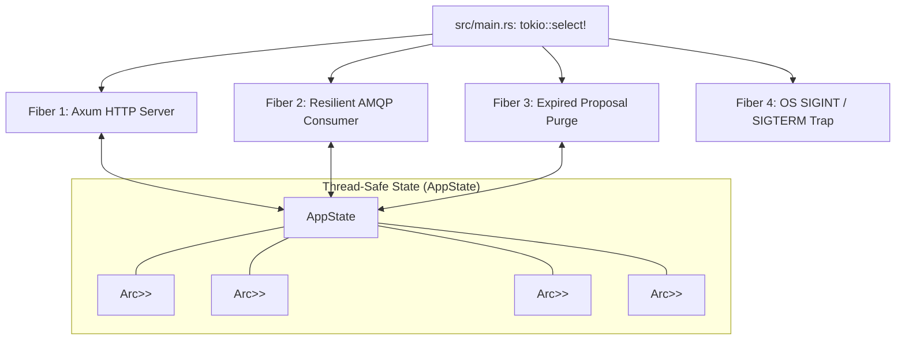

# Hybrid Orchestrator Architecture
# Hybrid Orchestrator Architecture & System Specification

This document explains the hybrid orchestrator from a system-design point of view. It focuses on boundaries, runtime flow, safety gates, failure behavior, and what must change before the service can execute real restocks.

---

## 1. Executive Summary

## 1. System context
The `hybrid-orchestrator` is a high-performance, fault-tolerant Rust operational service that bridges the eShop .NET microservice ecosystem, real-time demand analytics, sandboxed AI reasoning, and Human-in-the-Loop (HITL) operational governance.

It is designed to solve a fundamental challenge in automated supply-chain operations: **How to leverage real-time order streams and AI reasoning without risking unconstrained, catastrophic automated stock mutations.**

To achieve this, the system implements a strict **Hybrid Architecture**:
1. **Deterministic Analytics:** Microsecond statistical forecasting and discrete warehouse capacity simulation.
2. **Sandboxed AI Reasoning:** A strictly bounded LLM reasoning client restricted to explanation and candidate suggestions, with zero database, tool, or system execution privileges.
3. **Deterministic Governance:** A hardcoded rule-based policy gate (`PolicyGate`) that intercepts and validates all recommendations against ground-truth inventory levels before human review.
4. **Human-in-the-Loop Operational Boundary:** Proposals requiring approval are surfaced via REST API ("Boss Desk") and operate strictly in `LOG_ONLY` mode, emitting verified command previews rather than mutating inventory directly.
1. **Deterministic Analytics & Tools:** Microsecond statistical forecasting, ClickHouse analytical warehouse queries, and discrete warehouse capacity simulation exposed as deterministic tools.
2. **LLM-Driven Multi-Turn Decision Core:** A tool-calling reasoning agent (Groq / OpenAI) that autonomously inspects inventory snapshots, historical sales, demand forecasts, festival calendars, and supplier disruptions, deciding reorder actions and quantities through iterative inquiry.
3. **Deterministic Safety Firewall:** A thin, hard-limit mathematical boundary (`SafetyFirewall`) that strictly enforces maximum order quantity, non-negative bounds, warehouse capacity, and confidence validity immediately after LLM execution.
4. **Deterministic Governance (`PolicyGate`):** A hardcoded rule-based policy gate that intercepts and classifies proposals into `AutoApproved`, `RequiresHumanApproval`, or `Rejected` before human review.
5. **Human-in-the-Loop Operational Boundary:** Proposals requiring approval are surfaced via REST API ("Boss Desk") and operate strictly in `LOG_ONLY` mode, emitting verified command previews rather than mutating inventory directly.

---

## 2. High-Level System Context

```mermaid
flowchart LR
    Ordering[Ordering / eShop event producer]
    Rabbit[(RabbitMQ queue)]
    Orchestrator[hybrid-orchestrator]
    Feature[feature-engine crate]
    Agent[replenishment-agent crate]
    Boss[Boss Desk HTTP API]
    Human[Human operator]
    Inventory[Inventory.API]
    Governance[(Future governance DB)]
flowchart TD
    subgraph eShop Storefront [".NET Microservices Layer (RabbitMQ)"]
        Ordering[Ordering.API] -->|Publishes OrderStockConfirmed| RabbitMQ[(RabbitMQ EventBus)]
        Payment[PaymentProcessor] --> RabbitMQ
        OrderProc[OrderProcessor] --> RabbitMQ
    subgraph eShopStorefront [".NET Microservices Layer (RabbitMQ)"]
        Ordering["Ordering.API"] -->|"Publishes OrderStockConfirmed"| RabbitMQ[("RabbitMQ EventBus")]
        Payment["PaymentProcessor"] --> RabbitMQ
        OrderProc["OrderProcessor"] --> RabbitMQ
    end

    Ordering -->|Order stock event + balance snapshot| Rabbit
    Rabbit -->|AMQP delivery| Orchestrator
    Orchestrator --> Feature
    Orchestrator --> Agent
    Orchestrator -->|pending proposals| Boss
    Human -->|approve / inspect| Boss
    Boss -. LOG_ONLY command preview .-> Human
    Orchestrator -. future durable audit .-> Governance
    Boss -. future idempotent command .-> Inventory
    subgraph Data Platform ["PostgreSQL CDC & Storage (Kafka)"]
        InvAPI[Inventory.API] -->|Writes Transactions| Postgres[(PostgreSQL inventorydb)]
        Postgres -->|Logical WAL Stream| Debezium[Debezium Connect]
        Debezium -->|Raw Row Changes| Kafka[(Kafka Cluster)]
        Kafka --> cdc[cdc-consumer]
        cdc --> Lakehouse[(Bronze / Silver Parquet)]
        cdc --> ClickHouse[(ClickHouse Analytics)]
    subgraph DataPlatform ["PostgreSQL CDC & Storage (Kafka)"]
    subgraph DataPlatform ["PostgreSQL CDC & Storage (Kafka / ClickHouse)"]
        InvAPI["Inventory.API"] -->|"Writes Transactions"| Postgres[("PostgreSQL inventorydb")]
        Postgres -->|"Logical WAL Stream"| Debezium["Debezium Connect"]
        Debezium -->|"Raw Row Changes"| Kafka[("Kafka Cluster")]
        cdc["cdc-consumer"] -->|"Ingest Kafka Streams"| Kafka
        cdc --> Lakehouse[("Bronze / Silver Parquet")]
        cdc --> ClickHouse[("ClickHouse Analytics")]
    end

    classDef future stroke-dasharray: 5 5,color:#777;
    class Governance,Inventory future;
    subgraph Hybrid Orchestrator ["hybrid-orchestrator (AMQP / RabbitMQ)"]
        RabbitMQ -->|OrderStockConfirmed + Balance Snapshot| Consumer[Resilient AMQP Consumer]
        Consumer --> State[AppState & Rolling Feature Cache]
        State --> Agent[replenishment-agent]
        Agent --> Sim[SimulationEngine]
        Sim --> LLM[Sandboxed LlmClient]
        LLM --> Gate[PolicyGate Governance]
    subgraph HybridOrchestrator ["hybrid-orchestrator (AMQP / RabbitMQ)"]
    subgraph HybridOrchestrator ["hybrid-orchestrator (AMQP / RabbitMQ / Axum)"]
        RabbitMQ -->|"OrderStockConfirmed + Balance Snapshot"| Consumer["Resilient AMQP Consumer"]
        Consumer --> State["AppState & Rolling Feature Cache"]
        State --> Agent["replenishment-agent"]
        Agent --> Sim["SimulationEngine"]
        Sim --> LLM["Sandboxed LlmClient"]
        LLM --> Gate["PolicyGate Governance"]
        State --> Agent["replenishment-agent (Base Evaluation)"]
        Agent --> LLM["LLM Decision Core (Multi-Turn Tool Calling)"]
        LLM <--> Tools["Deterministic Tools (ClickHouse / Stat / Sim)"]
        LLM --> Firewall["Deterministic Safety Firewall"]
        Firewall --> Gate["PolicyGate Governance"]
        Gate --> State
        State --> HttpAPI[Axum HTTP API]
        State --> HttpAPI["Axum HTTP API"]
        State --> HttpAPI["Axum HTTP API (Boss Desk)"]
    end

    subgraph Operations ["Human-in-the-Loop (HITL)"]
        HttpAPI <-->|Review & Approve Proposals| Operator[Human Operator / Boss Desk]
        HttpAPI -. Emits LOG_ONLY Command Preview .-> Operator
        HttpAPI <-->|"Review & Approve Proposals"| Operator["Human Operator / Boss Desk"]
        HttpAPI -. "Emits LOG_ONLY Command Preview" .-> Operator
    end
```

Key point: Inventory remains the only service allowed to own stock. The current orchestrator only prepares proposals and command previews.
> **Key Invariant:** Inventory remains the only service allowed to own and mutate stock. The current orchestrator only prepares proposals and command previews.

---

## 2. Internal module architecture
## 3. Dual-Broker Architecture: Why RabbitMQ vs Kafka?
## 3. Concurrency Guarantees & Memory Partitioning

A frequent architectural question is:  
**"Why does `hybrid-orchestrator` use RabbitMQ while the core data platform (`cdc-consumer`) uses Kafka?"**
- **Granular Mutex Partitioning:** Instead of a single monolithic lock, `AppState` partitions shared memory into distinct `Arc<Mutex<T>>` buckets (`proposals`, `seen_events`, `feature_states`, `metrics`). An incoming HTTP telemetry request reading `metrics` will never block the background AMQP consumer updating `feature_states`.
- **Bounded Memory:** Expired proposals are purged periodically (`cleanup_interval`, default 60s) based on proposal TTL (default 1 hour) to guarantee strictly bounded memory usage.
- **Idempotent Ingestion:** The in-process deduplicator (`state.remember_event`) guarantees that duplicated RabbitMQ deliveries are acknowledged and skipped immediately without invoking the LLM or feature calculators.

The two brokers serve two distinct architectural tiers in eShop:

```mermaid
flowchart TB
    Main[src/main.rs]
    State[src/state.rs]
    Handler[src/event_handler.rs]
    Axum[Axum routes]
    Lapin[lapin consumer]
    Metrics[OrchestratorMetrics]
    Proposals[ProposalRecord store]
    Idempotency[seen event keys]
flowchart LR
    subgraph Operational Path ["Operational Tier: hybrid-orchestrator"]
        O1[Online Customer Checkout] --> O2[Ordering.API]
        O2 -->|Domain Event + Balance Snapshot| O3[(RabbitMQ)]
        O3 -->|Immediate Work Queue Dispatch| O4[hybrid-orchestrator]
        O4 --> O5[Operator Review & Approval]
    subgraph OperationalPath ["Operational Tier: hybrid-orchestrator"]
        O1["Online Customer Checkout"] --> O2["Ordering.API"]
        O2 -->|"Domain Event + Balance Snapshot"| O3[("RabbitMQ")]
        O3 -->|"Immediate Work Queue Dispatch"| O4["hybrid-orchestrator"]
        O4 --> O5["Operator Review & Approval"]
    end

    Main -->|loads env| State
    Main -->|starts HTTP task| Axum
    Main -->|starts AMQP task| Handler
    Axum -->|read/update| State
    Handler -->|read config / write proposals| State
    Handler --> Lapin
    State --> Metrics
    State --> Proposals
    State --> Idempotency
    subgraph Analytical Path ["Data Platform Tier: cdc-consumer"]
        A1[Any DB Mutation: Orders, Truck Restock, Adjustments] --> A2[(PostgreSQL WAL)]
        A2 -->|Logical CDC| A3[Debezium]
        A3 -->|Append-Only Partitioned Log| A4[(Kafka)]
        A4 -->|Log Replay & Storage| A5[cdc-consumer]
        A5 --> A6[Parquet Data Lake & ClickHouse]
    subgraph AnalyticalPath ["Data Platform Tier: cdc-consumer"]
        A1["Any DB Mutation: Orders, Truck Restock, Adjustments"] --> A2[("PostgreSQL WAL")]
        A2 -->|"Logical CDC"| A3["Debezium"]
        A3 -->|"Append-Only Partitioned Log"| A4[("Kafka")]
        A4 -->|"Log Replay & Storage"| A5["cdc-consumer"]
        A5 --> A6["Parquet Data Lake & ClickHouse"]
    end
```

The important refactor is that shared state is no longer a naked `Arc<Mutex<HashMap>>`. It is a typed `AppState` with named responsibilities.
### Key Differences:

## 3. Event-processing flow
1. **Event-Carried State Transfer vs. Raw DB Rows:**
   - **RabbitMQ:** Delivers high-level business domain events (`OrderStockConfirmedIntegrationEvent`). The payload carries both the **order facts** (order ID, quantity depleted) and an **authoritative balance snapshot** (on-hand, reserved, safety stock, max stock, version).
   - **Kafka:** Carries raw, low-level database row mutations (`inventory_balances` updates). It has no domain context regarding which customer order, basket, or business rule triggered the mutation.


2. **Elimination of Dual-Stream Race Conditions:**
   - If the orchestrator listened to RabbitMQ for Order events and Kafka for stock updates, network/broker lag between Debezium CDC and RabbitMQ would create classic out-of-order race conditions.
   - Packaging the authoritative balance snapshot directly in the RabbitMQ event guarantees that order facts and stock state arrive atomically.

Why this matters: bad data is rejected, missing stock state is not invented, duplicate deliveries are absorbed, and execution never happens behind the human's back.
3. **Competing Consumer Work Queue vs. Replayable Stream:**
   - **RabbitMQ:** Provides per-message ACK/NACK, Dead Letter Queues (DLQ), and point-to-point delivery semantics optimal for interactive human-in-the-loop task queues.
   - **Kafka:** Provides multi-partition ordered logs with offset retention (`auto.offset.reset = earliest`), essential for replaying historical transactions to train AI models or backfill Lakehouse Parquet files.

## 4. Human-in-the-loop sequence
---

## 4. Internal Component & Concurrency Architecture
## 4. Multi-Turn LLM Decision Core with Tool Calling

The service runtime coordinates four concurrent asynchronous fibers inside a multi-threaded Tokio runtime:
The decision engine replaces hardcoded replenishment formulas with an autonomous LLM reasoning loop, while keeping arithmetic and data access deterministic:



### Sequence Flow:

```mermaid
sequenceDiagram
    participant O as Ordering / Producer
    participant R as RabbitMQ
    participant H as hybrid-orchestrator
    participant F as feature-engine
    participant A as replenishment-agent
    participant U as Human operator
flowchart TB
    Main[src/main.rs: tokio::select!]
    Main --> HTTP[Fiber 1: Axum HTTP Server]
    Main --> AMQP[Fiber 2: Resilient AMQP Consumer]
    Main --> Cleanup[Fiber 3: Expired Proposal Purge]
    Main --> Signal[Fiber 4: OS SIGINT / SIGTERM Trap]
    participant L as Groq LLM (e.g. qwen/qwen3.8-27b)
    participant T as Tool Catalog (Rust / ClickHouse)
    participant F as Deterministic Safety Firewall
    participant P as PolicyGate

    O->>R: publish order stock event + balance snapshot
    R->>H: deliver message
    H->>H: validate payload + idempotency check
    H->>F: apply balance + sale movement, calculate features
    F-->>H: SkuLocationFeatures
    H->>A: evaluate decision + simulate alternatives
    A-->>H: decision, simulation, policy-ready proposal
    H->>A: PolicyGate decide
    A-->>H: AutoApproved / RequiresHumanApproval / Rejected
    H->>H: store ProposalRecord in memory
    H-->>R: ACK message
    U->>H: GET /api/v1/proposals
    H-->>U: proposals with decision/simulation/policy details
    U->>H: POST /api/v1/proposals/{id}/approve
    H-->>U: APPROVED + LOG_ONLY commandPreview
    subgraph StateManagement ["Thread-Safe State (AppState)"]
        State[AppState]
        Config[Arc<OrchestratorConfig>]
        LLM[LlmClient + CircuitBreaker]
        PropStore[Arc<Mutex<HashMap<Uuid, ProposalRecord>>>]
        SeenEvents[Arc<Mutex<HashSet<String>>>]
        Features[Arc<Mutex<HashMap<SkuLocation, SkuLocationState>>>]
        Metrics[Arc<Mutex<OrchestratorMetrics>>>]
    H->>L: Initial Prompt (System instructions + SKU/Location context)
    loop Tool Calling Rounds (Max 6 Rounds)
        L-->>H: tool_calls: [get_inventory_snapshot, get_demand_forecast, ...]
        H->>T: Execute tool with 5s timeout & LoopGuard
        T-->>H: Tool output JSON (or ERROR status)
        H->>L: Tool response message
    end

    HTTP <--> State
    AMQP <--> State
    Cleanup <--> State
    State --- PropStore
    State --- SeenEvents
    State --- Features
    State --- Metrics
    L-->>H: Final Synthesis JSON: {action, quantity, reasoning, confidence, ...}
    H->>F: Enforce SafetyFirewall (Capacity, Max Qty, Non-Negative)
    F-->>H: Validated Reorder Proposal
    H->>P: Classify Risk & Approval Requirements
    P-->>H: ProposalRecord stored for Boss Desk
```

The LLM is not shown as an actor with system access because it does not get system access. It only receives deterministic decision/simulation context and returns explanation text.
### Concurrency Guarantees & Memory Partitioning
### Concurrency Guarantees & Memory Partitioning:
- **Granular Mutex Partitioning:** Instead of a single monolithic lock, `AppState` partitions shared memory into distinct `Arc<Mutex<T>>` buckets (`proposals`, `seen_events`, `feature_states`, `metrics`). An incoming HTTP telemetry request reading `metrics` will never block the background AMQP consumer updating `feature_states`.
- **Bounded Memory:** Expired proposals are purged periodically (`cleanup_interval`, default 60s) based on proposal TTL (default 1 hour) to guarantee strictly bounded memory usage.
### Deterministic Tools Available to LLM:
1. `get_inventory_snapshot`: On-hand, reserved, available, incoming stock, and warehouse capacity.
2. `get_demand_features`: Velocity, acceleration, spike flags, rolling variances, days since last order.
3. `get_demand_forecast`: Horizon units, daily rate, trend slope, spike indicators.
4. `get_historical_sales`: Daily aggregated sales from ClickHouse `fact_inventory_movements`.
5. `run_statistical_analysis`: Computes mean, sample stddev, median, and OLS trend slope in Rust (zero unverified LLM arithmetic).
6. `simulate_reorder`: Evaluates hypothetical reorder quantities across simulated stockout probabilities and holding costs via `SimulationEngine`.
7. `get_event_calendar`: Queries upcoming festivals, holidays, and promotional events from ClickHouse `event_calendar`.
8. `get_supplier_signals`: Queries active disruption notices, lead time warnings, and severity ratings from ClickHouse `supplier_disruption_signals`.

## 5. Proposal state machine
---
### Resilience & Guardrails:
- **Per-Tool Timeout:** Each tool call has a strict 5-second timeout (`LLM_TOOL_TIMEOUT_SECONDS`).
- **Loop Guard:** Detects and blocks repeated identical tool calls within the same session.
- **Circuit Breaker:** Automatically trips after consecutive network/API failures, falling back to deterministic math (`ReplenishmentAgent::evaluate()`).
- **Full Trace Persistence:** Every decision stores full `ToolCallRecord { tool_name, input, output, timestamp }` records inside `LlmReasoning`.

## 5. Event Ingestion Pipeline & Payload Contract

The consumer subscribes to the durable queue `eshop.inventory.order_stock_confirmed`.

```mermaid
stateDiagram-v2
    [*] --> Proposed: policy requires HITL
    [*] --> Approved: auto-approved in LOG_ONLY preflight
    [*] --> Rejected: policy rejected
    Proposed --> Approved: human approval endpoint
    Proposed --> Rejected: future reject endpoint
    Approved --> Executing: future real executor only
    Executing --> Succeeded: future Inventory success
    Executing --> Failed: future Inventory failure
flowchart TD
    A[RabbitMQ Message Delivery] --> B{Valid JSON?}
    B -- No --> B1[NACK requeue=false -> DLQ]
    B -- Yes --> C{Valid Positive Quantities?}
    C -- No --> C1[NACK requeue=false -> Poison Error]
    C -- Yes --> D{Source Event Key Seen?}
    D -- Yes --> D1[ACK Message -> Duplicate Skipped]
    D -- No --> E{Authoritative Balance Present?}
    E -- No --> E1[ACK Message -> Safe Skip: Refuse to Guess Stock]
    E -- Yes --> F{Balance Invariants Hold?}
    F -- No --> F1[NACK requeue=false -> Invariant Failure]
    F -- Yes --> G[Apply Balance Snapshot & Movement Fact]
    G --> H[Recalculate Feature Engine Metrics]
    H --> I[Execute Replenishment Evaluation]
    A["RabbitMQ Message Delivery"] --> B{"Valid JSON?"}
    B -- No --> B1["NACK requeue=false -> DLQ"]
    B -- Yes --> C{"Valid Positive Quantities?"}
    C -- No --> C1["NACK requeue=false -> Poison Error"]
    C -- Yes --> D{"Source Event Key Seen?"}
    D -- Yes --> D1["ACK Message -> Duplicate Skipped"]
    D -- No --> E{"Authoritative Balance Present?"}
    E -- No --> E1["ACK Message -> Safe Skip: Refuse to Guess Stock"]
    E -- Yes --> F{"Balance Invariants Hold?"}
    F -- No --> F1["NACK requeue=false -> Invariant Failure"]
    F -- Yes --> G["Apply Balance Snapshot & Movement Fact"]
    G --> H["Recalculate Feature Engine Metrics"]
    H --> I["Execute Replenishment Evaluation"]
```

Current implementation reaches `Proposed`, `Approved`, or `Rejected`. `Executing`, `Succeeded`, and `Failed` are future real-executor states.

## 6. Data contracts

### Incoming event

### Ingress JSON Schema Contract:
```json
{
  "eventId": "d94bc7e4-1e8a-4a3e-a596-c633e0a17eb1",
  "orderId": 1001,
  "skuId": 42,
  "locationCode": "NCR",
  "quantityDepleted": 8,
  "occurredAt": "2026-09-17T08:30:00Z",
  "balance": {
    "onHand": 12,
    "reserved": 0,
    "safetyStock": 10,
    "reorderPoint": 30,
    "maxStock": 100,
    "version": 9,
    "updatedAt": "2026-09-17T08:30:01Z",
    "authoritative": true
  }
}
```

### Stored proposal record
### Mandatory Invariants:
1. $0 \le \text{reserved} \le \text{on\_hand} \le \text{max\_stock}$
2. $\text{safety\_stock} \le \text{reorder\_point} \le \text{max\_stock}$
3. $\text{available} = \text{on\_hand} - \text{reserved}$
4. If `authoritative == false`, data freshness drops to `Unreconciled`, forcing human review.

A `ProposalRecord` combines:
---

- proposal identity and status
- deterministic reorder decision
- simulation alternatives
- policy decision
- balance snapshot used for the decision
- data freshness status
- source event key
- execution attempts list
- human-readable message
## 6. Algorithmic & Mathematical Decision Model
## 5. Deterministic Safety Firewall

This makes the approval API explainable. A user can see why a proposal exists before approving it.
The decision engine combines real-time statistical feature engineering with discrete simulation.

## 7. Safety boundaries

```mermaid
flowchart LR
    Fact[InventoryMovementFact] --> Rolling[5m, 15m, 1h Sliding Windows]
    Rolling --> EWMA[Adaptive EWMA Forecast]
    EWMA --> Decision[ReplenishmentAgent::evaluate]
    Decision --> Candidates[Candidate Generation]
    Candidates --> Sim[SimulationEngine Grid Search]
    Sim --> Outcome[Optimal Capacity-Safe Proposal]
    Fact["InventoryMovementFact"] --> Rolling["5m, 15m, 1h Sliding Windows"]
    Rolling --> EWMA["Adaptive EWMA Forecast"]
    EWMA --> Decision["ReplenishmentAgent::evaluate"]
    Decision --> Candidates["Candidate Generation"]
    Candidates --> Sim["SimulationEngine Grid Search"]
    Sim --> Outcome["Optimal Capacity-Safe Proposal"]
```


| Boundary | Current behavior |
|---|---|
| Inventory state | Must arrive as balance snapshot; never guessed |
| LLM | Explanation only; no tools, DB, HTTP, shell, or queue access |
| Policy | Deterministic `PolicyGate` owns approval outcome |
| Execution | `LOG_ONLY`; no Inventory mutation |
| Idempotency | In-process event-key set; durable inbox still required |
| Approval storage | In-memory proposal store; durable governance DB still required |
| Bad messages | malformed JSON and invariant failures are nacked with `requeue=false` |
### Mathematical Formulas:

## 8. Failure and recovery model
1. **Learned Safety Stock ($S_{\text{learned}}$):**
   $$S_{\text{learned}} = Z \times \sigma_{\text{demand}} \times \sqrt{L_{\text{lead\_time\_days}}}$$
   *(Default service factor $Z = 1.65$ for 95% cycle service level)*

```mermaid
flowchart LR
    Fail[Failure] --> Parse[Malformed JSON]
    Fail --> Invariant[Invalid balance invariant]
    Fail --> Duplicate[Duplicate delivery]
    Fail --> Missing[Missing balance]
    Fail --> Restart[Service restart]
2. **Effective Safety Stock ($S_{\text{eff}}$):**
   $$S_{\text{eff}} = \max(S_{\text{learned}}, S_{\text{configured}})$$

    Parse --> ParseAction[NACK no requeue]
    Invariant --> InvAction[NACK no requeue]
    Duplicate --> DupAction[ACK skip]
    Missing --> MissingAction[ACK safe skip]
    Restart --> RestartAction[Pending in-memory proposals lost]
```
3. **Horizon Demand ($D_{\text{horizon}}$):**
   $$D_{\text{horizon}} = \sum_{t=1}^{\lceil L + R \rceil} \text{DailyForecast}_t$$
   *(Over lead time $L$ + review period $R$)*

Production hardening priority: replace in-memory proposal/idempotency state with durable governance tables before any real execution is enabled.
4. **Target Inventory ($I_{\text{target}}$):**
   $$I_{\text{target}} = \min(D_{\text{horizon}} + S_{\text{eff}}, \text{max\_stock})$$

## 9. Production-readiness checklist
5. **Recommended Reorder Quantity ($Q_{\text{rec}}$):**
   $$I_{\text{position}} = \text{on\_hand} - \text{reserved} + \text{incoming\_replenishment}$$
   $$\text{Capacity} = \max(0, \text{max\_stock} - \text{on\_hand} - \text{incoming\_replenishment})$$
   $$Q_{\text{rec}} = \min(\max(0, I_{\text{target}} - I_{\text{position}}), \text{Capacity})$$

Before enabling real stock mutation:
6. **Stockout Risk Classification:**
   $$\text{Stockout Hours} = \frac{\max(0, \text{available})}{\text{Forecast Units/Day}} \times 24$$
   - $\le 24\text{ hours} \implies$ **Critical Risk**
   - $\le 48\text{ hours} \implies$ **High Risk**
   - $\le 96\text{ hours} \implies$ **Medium Risk**
   - $> 96\text{ hours} \implies$ **Low Risk**

- [ ] durable proposal table
- [ ] durable incoming-event inbox table
- [ ] durable execution-attempt table
- [ ] DLQ topology and replay tooling
- [ ] authenticated approval endpoint
- [ ] authorized roles for approve/reject
- [ ] real Inventory command publisher or Inventory API client
- [ ] idempotent operation ID persisted before execution
- [ ] OpenTelemetry metrics/traces
- [ ] integration test with RabbitMQ + Inventory.API
- [ ] Aspire registration and health checks
- [ ] security review of event payload and approval API
---

## 7. Sandboxed AI Intelligence Layer

## 10. Production hardening architecture
The AI strategy officer integrates with LLM providers (Groq or OpenAI) using strict containment boundaries.

```mermaid
flowchart TB
    Rabbit[(RabbitMQ / Aspire eventbus)]
    Consumer[Resilient AMQP consumer]
    State[AppState feature store + proposal store]
    Feature[SkuLocationState rolling features]
    Agent[ReplenishmentAgent]
    Sim[SimulationEngine]
    LLM[Live LLM client Groq/OpenAI]
    Breaker[Circuit breaker + timeout]
    Limits[Hybrid hard limits]
    Policy[PolicyGate]
    Boss[Boss Desk API]

    Rabbit --> Consumer
    Consumer -->|event + balance snapshot| State
    State --> Feature
    Feature --> Agent
    Agent --> Sim
    Sim --> LLM
    LLM --> Breaker
    Breaker -->|valid structured JSON| Limits
    Breaker -->|429/timeout/5xx/malformed| Agent
    Limits -->|accepted| Policy
    Limits -->|rejected| Agent
    Policy --> State
    Boss --> State
flowchart TD
    Context[Deterministic Decision & Simulation Context] --> Prompt[Structured Prompt Formulation]
    Prompt --> HTTP[HTTPS Request with 3.5s Timeout]
    HTTP --> Breaker{Circuit Breaker Open?}
    Breaker -- Yes --> Fallback[Deterministic Fallback Reasoning]
    Breaker -- No --> Provider[Groq / OpenAI Inference API]
    Provider --> Schema{Valid propose_action JSON?}
    Schema -- No --> Fail[Record Failure & Trigger Fallback]
    Schema -- Yes --> Firewall{Passes HybridPolicyLimits?}
    Firewall -- No --> Veto[Policy Boundary Veto & Trigger Fallback]
    Firewall -- Yes --> Pass[Accepted AI Proposal]
    Context["Deterministic Decision & Simulation Context"] --> Prompt["Structured Prompt Formulation"]
    Prompt --> HTTP["HTTPS Request with 3.5s Timeout"]
    HTTP --> Breaker{"Circuit Breaker Open?"}
    Breaker -- Yes --> Fallback["Deterministic Fallback Reasoning"]
    Breaker -- No --> Provider["Groq / OpenAI Inference API"]
    Provider --> Schema{"Valid propose_action JSON?"}
    Schema -- No --> Fail["Record Failure & Trigger Fallback"]
    Schema -- Yes --> Firewall{"Passes HybridPolicyLimits?"}
    Firewall -- No --> Veto["Policy Boundary Veto & Trigger Fallback"]
    Firewall -- Yes --> Pass["Accepted AI Proposal"]
```

The LLM is deliberately boxed in:
### Deterministic Firewall (`HybridPolicyLimits`):
Even if the LLM generates valid JSON, the output is verified against hard mathematical limits before being accepted:
Even when the LLM generates valid JSON, the output is verified against hard mathematical limits before being accepted:
1. $Q_{\text{proposed}} \le \text{Capacity}$ (Never permits warehouse overflow)
2. $Q_{\text{proposed}} \le \text{LLM\_MAX\_ORDER\_QUANTITY}$ (Hard-capped at 5,000 units)
3. $\text{Markdown} \le \text{LLM\_MAX\_MARKDOWN\_PERCENT}$ (Hard-capped at 20.0%)
2. $Q_{\text{proposed}} \le \text{LLM\_MAX\_ORDER\_QUANTITY}$ (Hard-capped at 5,000 units by default)
3. $Q_{\text{proposed}} \ge 0$ (Zero negative quantities allowed)
4. $\text{Confidence} \in [0.0, 1.0]$

1. It receives only deterministic decision/simulation/balance context.
2. It must return `propose_action` JSON matching the schema.
3. Its HTTP call has a 3.5s timeout.
4. Rate limits/timeouts/errors open the circuit breaker and use deterministic fallback.
5. Hybrid hard limits reject rogue quantities/markdowns.
6. `PolicyGate` still decides whether a proposal can be auto-approved, rejected, or routed to HITL.
### Circuit Breaker Mechanics:
- **Failure Threshold:** 3 consecutive failures (timeouts $>3500\text{ms}$, HTTP 429 rate limits, HTTP 5xx, schema malformations).
- **Cooldown:** 30 seconds. While tripped, calls bypass external network I/O instantly and fall back to local deterministic reasoning.
If the firewall fails, the system safely falls back to the deterministic pipeline recommendations.

## 11. Message acknowledgement model
---

## 8. Deterministic Governance & State Machine
## 6. Deterministic Governance & State Machine

Every proposal transitions through a formal state machine:

```mermaid
flowchart TD
    A[AMQP delivery] --> B{Parse JSON?}
    B -- no --> P[NACK requeue=false]
    B -- yes --> C{Validate schema and invariants?}
    C -- no --> P
    C -- yes --> D{Duplicate event?}
    D -- yes --> ACK[ACK]
    D -- no --> E[Update rolling feature state]
    E --> F{Transient platform failure?}
    F -- yes --> R[NACK requeue=true]
    F -- no --> G[LLM/governance/proposal]
    G --> ACK
stateDiagram-v2
    [*] --> Proposed: Policy Requires Human Review
    [*] --> Approved: Auto-Approved (Low Risk Only)
    [*] --> Rejected: Policy Denied (Zero Quantity / Invalid)
    
    Proposed --> Approved: Human POST /approve
    Proposed --> Failed: TTL Elapsed (Expired)
    
    Approved --> Executing: Future Real Executor
    Executing --> Succeeded: Future Stock Confirmed
    Executing --> Failed: Future Inventory API Error
```

Poison pills do not loop forever. Transient platform failures are requeued.
### PolicyGate Decision Matrix:
- **Low Risk + Fresh Data:** $\implies$ `AutoApproved` (in `LOG_ONLY` mode, prepares execution preflight).
- **Medium / High / Critical Risk:** $\implies$ `RequiresHumanApproval` (staged for Boss Desk operator).
- **Stale or Unreconciled Data:** $\implies$ `RequiresHumanApproval` (execution safety override).
- **Zero Quantity:** $\implies$ `Rejected`.

## 12. Runtime state
---

`AppState` now contains:
## 9. Human-in-the-Loop (HITL) REST API Specification
## 9. Failure and Recovery Model
## 7. Human-in-the-Loop (HITL) REST API Specification

- typed config loaded from environment
- `LlmClient` with provider/circuit state
- in-process idempotency keys
- rolling `SkuLocationState` feature store per SKU/location
- proposal records with TTL
- audit events
- health/readiness fields
- operational metrics
Default bind address: `127.0.0.1:5000`.
```mermaid
flowchart LR
    Fail["Failure"] --> Parse["Malformed JSON"]
    Fail --> Invariant["Invalid balance invariant"]
    Fail --> Duplicate["Duplicate delivery"]
    Fail --> Missing["Missing balance"]
    Fail --> Restart["Service restart"]

The in-memory proposal/idempotency stores are production-shaped but not production-durable yet. Before real execution mode is enabled, move them to governance PostgreSQL tables.
    Parse --> ParseAction["NACK no requeue"]
    Invariant --> InvAction["NACK no requeue"]
    Duplicate --> DupAction["ACK skip"]
    Missing --> MissingAction["ACK safe skip"]
    Restart --> RestartAction["Pending in-memory proposals lost"]
```

| Boundary | Current behavior |
|---|---|
| **Inventory state** | Must arrive as balance snapshot; never guessed |
| **LLM** | Explanation only; no tools, DB, HTTP, shell, or queue access |
| **Policy** | Deterministic `PolicyGate` owns approval outcome |
| **Execution** | `LOG_ONLY`; no Inventory mutation |
| **Idempotency** | In-process event-key set; durable inbox still required |
| **Approval storage** | In-memory proposal store; durable governance DB still required |
| **Bad messages** | Malformed JSON and invariant failures are nacked with `requeue=false` |

---

## 10. Human-in-the-Loop (HITL) REST API Specification

Default bind address: `127.0.0.1:5005` (configured via `HYBRID_ORCHESTRATOR_BIND`).

### 1. Health & Telemetry Check
```http
GET /health
```
**Response (HTTP 200 OK / 503 Degraded):**
```json
{
  "status": "Healthy",
  "ready": true,
  "queue": "eshop.inventory.order_stock_confirmed",
  "executionMode": "LOG_ONLY",
  "amqpConnected": true,
  "llm": {
    "provider": "GROQ",
    "configured": true,
    "circuitOpen": false,
    "consecutiveFailures": 0,
    "model": "llama-3.3-70b-versatile"
    "model": "qwen/qwen3.8-27b"
  },
  "metrics": {
    "deliveriesSeen": 42,
    "eventsProcessed": 42,
    "invalidEvents": 0,
    "duplicateEvents": 1,
    "proposalsCreated": 15,
    "autoApproved": 3,
    "humanApprovalRequired": 12,
    "approvals": 10,
    "llmFallbacks": 0
  }
}
```

### 2. List Pending & Historical Proposals
```http
GET /api/v1/proposals
```

### 3. Get Proposal Detail
### 3. Get Proposal Detail (including Tool Call Audit Traces)
```http
GET /api/v1/proposals/{proposalId}
```

### 4. Approve Proposal (Human Action)
```http
POST /api/v1/proposals/{proposalId}/approve
```
**Response (HTTP 202 Accepted):**
```json
{
  "proposalId": "f7d24a98-842e-5034-bc84-90a6e0c4a451",
  "status": "APPROVED",
  "executionMode": "LOG_ONLY",
  "message": "approved by human; LOG_ONLY command emission recorded without mutating Inventory",
  "commandPreview": {
    "operationId": "f7d24a98-842e-5034-bc84-90a6e0c4a451",
    "skuId": 42,
    "locationCode": "NCR",
    "quantity": 25
  }
}
```

---

## 10. Execution Safety: Why `LOG_ONLY` Mode?
## 11. Execution Safety: Why `LOG_ONLY` Mode?
## 8. Verification & Testing Strategy

Currently, the service runs strictly under `HYBRID_ORCHESTRATOR_EXECUTION_MODE=LOG_ONLY`.

### Rationale:
A production replenishment execution agent must never directly mutate a database without:
1. **Durable Transactional Outbox/Inbox:** Guaranteed at-least-once message delivery with idempotent execution on `Inventory.API`.
2. **Distributed Idempotency:** Ensuring that network retries never trigger double-purchases or duplicate purchase orders.
3. **Auditable Governance Database:** Persisting human approvals, policy decisions, and execution attempts in durable PostgreSQL tables rather than volatile memory.

In `LOG_ONLY` mode, approving a proposal logs the audit trail and outputs an exact `commandPreview` struct, proving full end-to-end readiness while safeguarding physical inventory.

---

## 11. Verification & Testing Strategy
## 12. Verification & Testing Strategy

The crate enforces comprehensive multi-level automated verification:

| Level | Test Suite | Scope |
|---|---|---|
| **Unit Tests** | `cargo test -p hybrid-orchestrator` | Configuration parsing, event validation, LLM JSON schema parsing, boundary cap violations, circuit breaker failovers |
| **Domain Logic** | `cargo test -p replenishment-agent` | Safety stock calculation, horizon demand, candidate quantity simulations, policy gate outcomes, preflight executor checks |
| **End-to-End Integration** | `e2e_tests::test_end_to_end_event_to_approval_flow` | Ingests real depletion events $\to$ updates feature state $\to$ evaluates replenishment $\to$ runs simulation $\to$ evaluates policy gate $\to$ binds ephemeral HTTP server $\to$ verifies `/health`, `/proposals`, and `/approve` HTTP endpoints |
| **Unit Tests** | `cargo test -p hybrid-orchestrator` | Configuration parsing, event validation, LLM JSON schema parsing, tool calling execution, loop guard, safety firewall limits, circuit breaker failovers |
| **Domain Logic** | `cargo test -p replenishment-agent` | Safety stock calculation, horizon demand, candidate quantity simulations, tool call records, policy gate outcomes |
| **Warehouse Integration** | `cargo test -p warehouse` | Analytical warehouse schema, ClickHouse SQL generators, event calendar queries, supplier disruption queries |
| **Static Analysis** | `cargo clippy --all-targets -- -D warnings` | Zero deadlocks, zero clippy warnings, strict lint compliance |
| **Formatting** | `cargo fmt --all --check` | Clean, standardized Rust formatting |

---

## 12. Production Roadmap & Hardening
## 13. Production Roadmap & Hardening

Before transitioning from `LOG_ONLY` to real automated execution against `Inventory.API`:

- [ ] **Durable Governance DB:** Migrate in-memory `ProposalRecord` and `seen_events` to PostgreSQL governance tables using `tokio-postgres`.
- [ ] **Idempotent Inventory Command Publisher:** Publish typed `OrderRestockCommand` integration events to RabbitMQ with unique `operationId`s.
- [ ] **Role-Based Authentication:** Secure the `/approve` endpoint with OAuth2 / OpenID Connect tokens issued by `Identity.API`.
- [ ] **OpenTelemetry Integration:** Export distributed traces and Prometheus metrics for queue lag, simulation time, and LLM latency.
