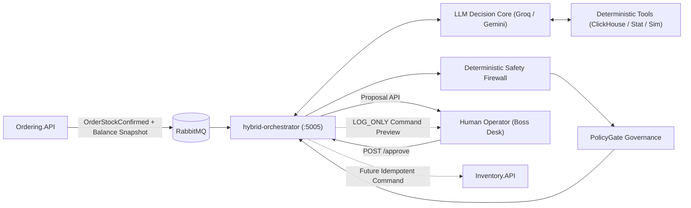

# Hybrid Orchestrator

`hybrid-orchestrator` is a high-performance Rust service bridging the eShop .NET microservice ecosystem, real-time demand analytics, autonomous LLM reasoning, and Human-in-the-Loop (HITL) operational governance.

It consumes inventory depletion events from RabbitMQ, executes an autonomous multi-turn tool-calling loop (Groq / Gemini / OpenAI) over real-time features and ClickHouse warehouse data, validates decisions through a deterministic `SafetyFirewall`, and surfaces governed proposals for human review.

It is intentionally **not** allowed to mutate Inventory directly yet; it operates in `LOG_ONLY` mode.

---

## Architectural & Technical Specifications

For deep system design and operational details:

- [ARCHITECTURE.md](ARCHITECTURE.md) — System context, dual-broker architecture (RabbitMQ vs Kafka), multi-turn tool-calling loop, deterministic safety firewall, and state machines.
- [RUNBOOK.md](RUNBOOK.md) — Local operation, health checks, incident troubleshooting, and quota management.
- [SYSTEM_ENGINEERING_DEEP_DIVE.md](SYSTEM_ENGINEERING_DEEP_DIVE.md) — Low-level technical dossier, memory layout, thread safety, and invariants.
- [AGENT_WALKTHROUGH.md](AGENT_WALKTHROUGH.md) — Code-level walkthrough of the implementation.

---

## High-Level Architecture



---

## Current Production Posture

1. **LLM-Driven Decision Core with Tool Calling:**
   - Supports **Groq** (`openai/gpt-oss-20b`, ~40ms reasoning model with native tool calling) and **Google Gemini** (`gemini-3.1-flash-lite`, 1M TPM capacity).
   - Autonomous multi-turn investigation querying inventory snapshots, sliding-window features, multi-day forecasts, Indian festival calendars, and supplier disruption signals.
   - Rust-side loop continuation guard enforces that mandatory domain tools (`get_event_calendar` and `get_supplier_signals`) are actively queried before final decision synthesis.
2. **Deterministic Mathematical Boundary:**
   - All arithmetic (EWMA, seasonal decomposition, sample standard deviation, OLS linear trend slope, grid-search simulation) executes in pure Rust via callable tools (`run_statistical_analysis`, `simulate_reorder`).
   - Zero freehand or unverified mental math by the LLM.
3. **Deterministic Safety Firewall:**
   - Validates the LLM's synthesis against warehouse capacity (`max_stock - on_hand`) and budget caps (`max_order_quantity`).
   - **Deterministic Stockout Governance:** If `on_hand <= 0`, `available <= 0`, or `on_hand <= safety_stock`, the firewall elevates `LOW` risk to `MEDIUM`.
4. **Deterministic Policy Gate (`PolicyGate`):**
   - Intercepts all recommendations and classifies them into `AutoApproved`, `RequiresHumanApproval`, or `Rejected`.
   - Complete stockouts and elevated risks strictly require human approval (`RequiresHumanApproval`).
5. **Human-in-the-Loop Operational Boundary:**
   - Operates in `LOG_ONLY` mode. Approving a proposal returns a validated, idempotent command preview without mutating physical stock.

---

## Required RabbitMQ Payload Contract

The orchestrator subscribes to `eshop.inventory.order_stock_confirmed`. Events must supply order facts plus an authoritative balance snapshot:

```json
{
  "eventId": "d94bc7e4-1e8a-4a3e-a596-c633e0a17eb1",
  "orderId": 1001,
  "skuId": 2,
  "locationCode": "BLR",
  "quantityDepleted": 30,
  "occurredAt": "2026-09-23T10:00:00Z",
  "balance": {
    "onHand": 0,
    "reserved": 0,
    "safetyStock": 50,
    "reorderPoint": 100,
    "maxStock": 500,
    "version": 1790150801,
    "updatedAt": "2026-09-23T10:00:00Z",
    "authoritative": true
  }
}
```

**Validation Invariants:**
- `orderId`, `skuId`, and `quantityDepleted` must be positive integers.
- `locationCode` is normalized to uppercase.
- Invariants must hold: $0 \le \text{reserved} \le \text{on\_hand} \le \text{max\_stock}$ and $\text{safety\_stock} \le \text{reorder\_point} \le \text{max\_stock}$.
- If `authoritative: false`, data freshness drops to `UNRECONCILED`, forcing human review.

---

## Runtime API ("Boss Desk")

Default listen address: `127.0.0.1:5005`.

```bash
# Health and readiness check (AMQP, LLM circuit status, metrics)
curl -s http://127.0.0.1:5005/health | jq .

# List all current replenishment proposals
curl -s http://127.0.0.1:5005/api/v1/proposals | jq .

# Get specific proposal details with reasoning and tool execution trace
curl -s http://127.0.0.1:5005/api/v1/proposals/<proposal-id> | jq .

# Human approval endpoint
curl -s -X POST http://127.0.0.1:5005/api/v1/proposals/<proposal-id>/approve | jq .
```

Approval returns a verified `commandPreview`:
```json
{
  "proposalId": "3c16c57e-7ae3-5690-a557-90329e16e0c4",
  "status": "APPROVED",
  "executionMode": "LOG_ONLY",
  "message": "approved by human; execution publisher is LOG_ONLY, so no Inventory command was sent",
  "commandPreview": {
    "operationId": "3c16c57e-7ae3-5690-a557-90329e16e0c4",
    "skuId": 2,
    "locationCode": "BLR",
    "quantity": 100
  }
}
```

---

## Configuration Reference

Configuration is loaded from environment variables or a local `.env` file:

| Variable | Default | Description |
| :--- | :--- | :--- |
| `LLM_PROVIDER` | `groq` | Provider selection: `groq`, `gemini`, `openai`, or `disabled`. |
| `GROQ_API_KEY` | None | Groq Cloud API key. |
| `GROQ_MODEL` | `openai/gpt-oss-20b` | Model used on Groq (fast reasoning model with native tool calling). |
| `GEMINI_API_KEY` | None | Google AI Studio API key. |
| `GEMINI_MODEL` | `gemini-3.1-flash-lite` | Model used on Gemini (1,000,000 TPM limit). |
| `CLICKHOUSE_URL` | `http://127.0.0.1:20255` | ClickHouse analytical HTTP endpoint. |
| `CLICKHOUSE_DATABASE` | `eshop_analytics` | ClickHouse analytics database. |
| `HYBRID_ORCHESTRATOR_BIND` | `127.0.0.1:5005` | Axum HTTP bind address. |
| `AMQP_URL` | Auto-discovered | RabbitMQ AMQP URL. |
| `LLM_MAX_TOOL_ROUNDS` | `6` | Maximum tool-calling conversation rounds. |
| `LLM_TOOL_TIMEOUT_SECONDS` | `5` | Execution timeout per individual tool call. |
| `LLM_MAX_IDENTICAL_TOOL_CALLS` | `1` | LoopGuard threshold preventing repeated identical tool calls. |
| `HYBRID_ORCHESTRATOR_EXECUTION_MODE` | `LOG_ONLY` | Safety execution mode (`LOG_ONLY` enforced). |

---

## Local Verification & Testing

```bash
cd src/RustDataPlatform
cargo fmt --all --check
cargo test -p hybrid-orchestrator
cargo clippy -p hybrid-orchestrator --all-targets -- -D warnings
```

All 33 unit tests in `hybrid-orchestrator` and 67 workspace tests pass.
