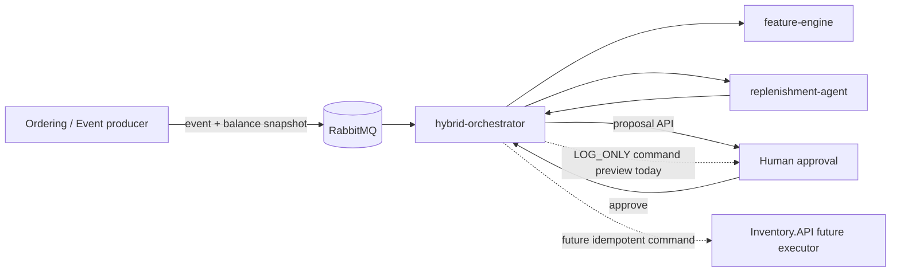

# Hybrid Orchestrator

`hybrid-orchestrator` is a Rust bridge for human-in-the-loop replenishment decisions. It consumes approved inventory/order events from RabbitMQ, runs the existing Rust data-platform engines, and exposes a small HTTP API for reviewing proposals.

It is intentionally **not** a duplicate forecasting engine and it is intentionally **not** allowed to mutate Inventory directly yet.


## Diagrams and deeper docs

Start here if you want the full picture:

- [Architecture](ARCHITECTURE.md) — system diagram, event flow, sequence diagram, state machine, safety boundaries.
- [Agent walkthrough](AGENT_WALKTHROUGH.md) — code-level explanation of what changed and why.
- [Runbook](RUNBOOK.md) — local operation, health checks, failure handling, and production gaps.

### High-level architecture



## Current production posture

This crate is now a safe integration boundary, not a toy agent:

- It uses `feature-engine::SkuLocationState` for demand features.
- It uses `replenishment-agent::ReplenishmentAgent` for reorder decisions.
- It uses `replenishment-agent::SimulationEngine` for capacity-safe candidate comparison.
- It uses `replenishment-agent::PolicyGate` for deterministic governance.
- It uses `LlmReasoner` only for explanation text; the LLM never decides execution.
- It refuses to fabricate stock state if a RabbitMQ event does not include a balance snapshot.
- It deduplicates events in-process by source event key.
- It exposes health, metrics, proposal list, proposal detail, and approval endpoints.
- It runs in `LOG_ONLY` execution mode. Approval prepares a command preview but does not publish or call Inventory.

## Why `LOG_ONLY` is deliberate

A real replenishment executor must have durable idempotency, audit, retry, and an Inventory command contract. This crate currently stores proposal state in memory, so it must not claim to execute physical stock operations. The approval endpoint therefore returns a command preview and records approval state only.

The future production executor should either:

1. publish a typed command to the same integration-event infrastructure with a stable `operationId`, or
2. call Inventory.API through a purpose-built executor client with idempotent operation IDs.

Until that exists, `HYBRID_ORCHESTRATOR_EXECUTION_MODE=LOG_ONLY` is the only supported mode.

## Required RabbitMQ payload contract

The old implementation guessed inventory state using `50 - quantity_depleted`. That is unsafe and has been removed.

The event must provide order facts plus a balance snapshot:

```json
{
  "eventId": "d94bc7e4-1e8a-4a3e-a596-c633e0a17eb1",
  "orderId": 1001,
  "skuId": 42,
  "locationCode": "NCR",
  "quantityDepleted": 8,
  "occurredAt": "2026-09-17T08:30:00Z",
  "balance": {
    "onHand": 12,
    "reserved": 0,
    "safetyStock": 10,
    "reorderPoint": 30,
    "maxStock": 100,
    "version": 9,
    "updatedAt": "2026-09-17T08:30:01Z",
    "authoritative": true
  }
}
```

Rules:

- `orderId`, `skuId`, and `quantityDepleted` must be positive.
- `locationCode` is normalized to uppercase.
- `balance` is required for feature calculation.
- balance invariants must hold: `0 <= reserved <= on_hand <= max_stock` and `safety_stock <= reorder_point <= max_stock`.
- `authoritative: true` marks the decision data as `FINAL`.
- non-authoritative balances are treated as `UNRECONCILED`, which forces human approval through `PolicyGate`.

## Runtime API

Default bind address: `127.0.0.1:5000`.

```bash
curl http://127.0.0.1:5000/health
curl http://127.0.0.1:5000/api/v1/proposals
curl http://127.0.0.1:5000/api/v1/proposals/<proposal-id>
curl -X POST http://127.0.0.1:5000/api/v1/proposals/<proposal-id>/approve
```

Approval response includes a `commandPreview`:

```json
{
  "proposalId": "...",
  "status": "APPROVED",
  "executionMode": "LOG_ONLY",
  "message": "approved by human; execution publisher is LOG_ONLY, so no Inventory command was sent",
  "commandPreview": {
    "operationId": "...",
    "skuId": 42,
    "locationCode": "NCR",
    "quantity": 25
  }
}
```

## Configuration

| Variable | Default | Meaning |
|---|---:|---|
| `AMQP_URL` | `amqp://127.0.0.1:5672/%2f` | RabbitMQ connection string |
| `HYBRID_ORCHESTRATOR_QUEUE` | `eshop.inventory.order_stock_confirmed` | Queue consumed by this bridge |
| `HYBRID_ORCHESTRATOR_CONSUMER_TAG` | `hybrid-orchestrator` | AMQP consumer tag |
| `HYBRID_ORCHESTRATOR_BIND` | `127.0.0.1:5000` | Axum HTTP bind address |
| `HYBRID_ORCHESTRATOR_EXECUTION_MODE` | `LOG_ONLY` | Only supported execution mode today |
| `GROQ_API_KEY` | unset | If present, the production reasoner is attempted; the current implementation safely falls back to mock reasoning when unavailable |
| `RUST_LOG` | `hybrid_orchestrator=info,info` | Log filtering |

## Local verification

```bash
cd src/RustDataPlatform
cargo fmt --all --check
cargo test -p hybrid-orchestrator
cargo clippy -p hybrid-orchestrator --all-targets -- -D warnings
```

Latest verification result: 4 focused tests passed and Clippy passed with warnings denied.


## Production hardening quick start

Manual run with Aspire RabbitMQ and Groq:

```bash
aspire describe eventbus --format Json
export AMQP_URL='amqp://<user>:<password>@127.0.0.1:<mapped-port>/%2f'
export GROQ_API_KEY='gsk_...'

cd src/RustDataPlatform
cargo run -p hybrid-orchestrator
```

If Groq is unavailable, set `OPENAI_API_KEY` instead. If neither key is set, the service remains operational and uses deterministic fallback reasoning.

Health endpoint:

```bash
curl -sS http://127.0.0.1:5000/health | jq
```

The response includes AMQP readiness, LLM provider/circuit status, and processing metrics.
