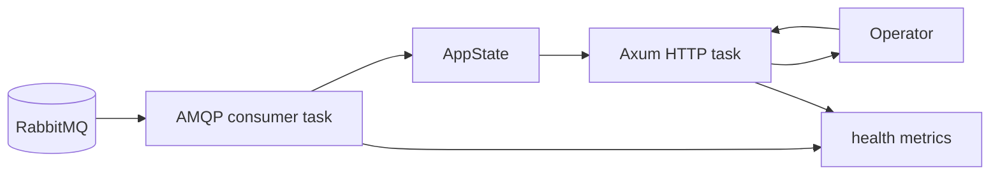

# Hybrid Orchestrator Runbook

This runbook is for operating the Rust `hybrid-orchestrator` safely in local/dev environments.

## 1. What this service does

The service has two loops:

1. RabbitMQ consumer loop: reads stock/order events, validates the payload, computes features, creates governed proposals.
2. Axum HTTP loop: lets a human inspect and approve pending proposals.

It does **not** execute real Inventory restocks yet. It runs in `LOG_ONLY` mode.

## 2. Start prerequisites

- RabbitMQ is running.
- The queue named by `HYBRID_ORCHESTRATOR_QUEUE` exists or can be declared.
- Events include the required `balance` object.
- Rust dependencies are already fetched/built.


## 2.1 Operational topology



Both tasks run in one process. If the process restarts, in-memory proposals and duplicate-event memory are lost. That is acceptable for local/dev and unacceptable for real execution.

## 3. Build and test

```bash
cd /home/cleaff/eShop/src/RustDataPlatform
cargo test -p hybrid-orchestrator
cargo clippy -p hybrid-orchestrator --all-targets -- -D warnings
```

Expected result:

- tests pass
- no Clippy warnings

## 4. Run

```bash
cd /home/cleaff/eShop/src/RustDataPlatform
RUST_LOG=hybrid_orchestrator=info,info \
HYBRID_ORCHESTRATOR_EXECUTION_MODE=LOG_ONLY \
cargo run -p hybrid-orchestrator
```

Expected startup logs:

- LLM mode message
- bind address
- queue name
- execution mode
- RabbitMQ subscription message

## 5. Health check

```bash
curl -sS http://127.0.0.1:5000/health | jq
```

Important fields:

- `status`: service status
- `executionMode`: must be `LOG_ONLY`
- `metrics.deliveriesSeen`: number of AMQP deliveries seen
- `metrics.invalidEvents`: bad JSON or invalid payloads
- `metrics.duplicateEvents`: in-process duplicate event keys skipped
- `metrics.proposalsCreated`: proposals stored for audit/HITL
- `metrics.llmFallbacks`: production reasoner was unavailable and mock explanation was used

## 6. Inspect proposals

```bash
curl -sS http://127.0.0.1:5000/api/v1/proposals | jq
curl -sS http://127.0.0.1:5000/api/v1/proposals/<proposal-id> | jq
```

The proposal record contains:

- original proposal
- deterministic decision
- simulation alternatives
- policy decision
- balance snapshot used for the decision
- data freshness status
- source event key
- current proposal status

## 7. Human approval

```bash
curl -sS -X POST \
  http://127.0.0.1:5000/api/v1/proposals/<proposal-id>/approve | jq
```

In the current implementation this changes the in-memory proposal status to `APPROVED` and returns a command preview. It does not publish to RabbitMQ and does not call Inventory.API.

## 8. Failure modes

### Missing balance in event

Behavior: event is acknowledged after being safely skipped; no proposal is created.

Reason: the orchestrator refuses to fabricate inventory state.

Fix: update the producer contract so the event includes the `balance` object, or add a real Inventory read-model tool/client before feature calculation.

### Invalid balance invariants

Behavior: processing error metric increments and the message is nacked with `requeue=false`.

Reason: accepting invalid stock numbers could produce unsafe recommendations.

Fix: repair the producer or route the message to a DLQ for inspection.

### Duplicate event

Behavior: duplicate source event key is skipped idempotently in process and acked.

Limit: this is memory-backed; restart clears duplicate memory. Production needs durable inbox/idempotency storage.

### LLM unavailable

Behavior: deterministic `MockLlmReasoner` generates explanation text.

Reason: LLM is advisory only. Governance and execution are deterministic.

### Service restart

Behavior: pending proposals are lost because the store is memory-backed.

Fix before production: move `ProposalRecord` persistence to PostgreSQL governance tables.

## 9. Production gaps before real execution

Do not enable real mutation until these are implemented:

1. Durable proposal/audit persistence.
2. Durable incoming-event inbox keyed by source event ID.
3. DLQ/retry policy for poison messages.
4. Real Inventory command publisher or Inventory.API executor client.
5. Idempotent `operationId` persisted before execution.
6. AuthN/AuthZ on approval endpoints.
7. Metrics export to OpenTelemetry/Prometheus.
8. Integration tests with RabbitMQ and Inventory.API.


## 10. Incident checklist

Use this quick checklist when the service behaves unexpectedly:

| Symptom | Check | Likely cause |
|---|---|---|
| `/health` unreachable | process logs / bind address | service not started or port conflict |
| `invalidEvents` rising | RabbitMQ payload body | producer contract mismatch |
| `featureSkips` rising | event has `balance`? | producer did not include required snapshot |
| `duplicateEvents` rising | event IDs | repeated RabbitMQ delivery or duplicate producer sends |
| no proposals created | policy/forecast details | demand is normal or recommended quantity is zero |
| approvals return `409` | proposal status | proposal already approved/rejected |
| approval did not restock | `executionMode` | expected: current mode is `LOG_ONLY` |

## 11. Documentation map

- [README](README.md): overview, payload/API contract, quick verification.
- [ARCHITECTURE](ARCHITECTURE.md): architecture diagrams, event flow, sequence, state machine, safety boundaries.
- [AGENT_WALKTHROUGH](AGENT_WALKTHROUGH.md): code-level explanation for learning and review.
- [RUNBOOK](RUNBOOK.md): operational commands and troubleshooting.


## Production hardening update: live LLM + Aspire AMQP

The orchestrator no longer assumes RabbitMQ is reachable on `127.0.0.1:5672`. It resolves AMQP in this order:

1. `AMQP_URL`
2. `ConnectionStrings__eventbus`
3. `ConnectionStrings__EventBus`
4. fallback `amqp://127.0.0.1:5672/%2f`

### Resolve RabbitMQ from Aspire

Use Aspire to inspect the `eventbus` resource:

```bash
aspire describe eventbus --format Json
```

Look for the AMQP endpoint/connection string, then export it before running the service manually:

```bash
export AMQP_URL='amqp://<user>:<password>@127.0.0.1:<mapped-port>/%2f'
```

If the orchestrator is later registered inside AppHost, Aspire should inject `ConnectionStrings__eventbus` automatically.

### Live LLM provider setup

Groq is preferred when both keys are present:

```bash
export GROQ_API_KEY='gsk_...'
export GROQ_MODEL='llama-3.3-70b-versatile'
```

OpenAI is fallback when `GROQ_API_KEY` is absent:

```bash
export OPENAI_API_KEY='sk-...'
export OPENAI_MODEL='gpt-4o-mini'
```

The LLM request uses strict JSON schema output named `propose_action`. The schema requires:

```json
{
  "action": "REORDER|WAIT|REVIEW",
  "reorder_quantity": 0,
  "markdown_percent": 0,
  "urgency": "LOW|MEDIUM|HIGH|CRITICAL",
  "summary": "...",
  "key_points": ["..."],
  "confidence": 0.85
}
```

The LLM has a strict timeout:

```bash
export LLM_TIMEOUT_MILLISECONDS=3500
```

Circuit breaker settings:

```bash
export LLM_CIRCUIT_FAILURE_THRESHOLD=3
export LLM_CIRCUIT_COOLDOWN_SECONDS=30
```

Deterministic safety caps:

```bash
export LLM_MAX_MARKDOWN_PERCENT=20
export LLM_MAX_ORDER_QUANTITY=5000
```

### Run manually

```bash
cd /home/cleaff/eShop/src/RustDataPlatform
AMQP_URL='amqp://...' \
GROQ_API_KEY='gsk_...' \
HYBRID_ORCHESTRATOR_EXECUTION_MODE=LOG_ONLY \
RUST_LOG=hybrid_orchestrator=info,info \
cargo run -p hybrid-orchestrator
```

### Health/readiness

```bash
curl -sS http://127.0.0.1:5000/health | jq
```

Important fields:

- `ready`: true only when AMQP is connected.
- `amqp_connected`: live AMQP connection state.
- `llm.provider`: `GROQ`, `OPEN_AI`, or `DISABLED`.
- `llm.circuit_open`: true when recent LLM failures opened the breaker.
- `metrics.llmFallbacks`: deterministic fallback count.
- `metrics.llmPolicyRejections`: LLM proposals rejected by deterministic hard limits.
- `metrics.amqpReconnects`: AMQP reconnect loop count.

### AMQP failure behavior

| Failure | Behavior |
|---|---|
| RabbitMQ starts late | exponential backoff reconnect; process does not crash |
| AMQP disconnect | consumer loop reconnects and health becomes degraded until connected |
| malformed JSON | `nack(requeue=false)` poison pill |
| invalid schema / invalid balance invariants | `nack(requeue=false)` poison pill |
| transient feature-state/platform error | `nack(requeue=true)` |
| duplicate event key | `ack`, skipped idempotently |

### LLM failure behavior

| Failure | Behavior |
|---|---|
| HTTP 429 rate limit | deterministic fallback, circuit failure count increments |
| timeout over 3.5s | deterministic fallback, consumer does not block indefinitely |
| HTTP 5xx | deterministic fallback |
| malformed LLM JSON | deterministic fallback |
| excessive reorder quantity / markdown | deterministic fallback + policy rejection metric |

The LLM never executes commands. It can only propose structured text/quantity. The existing `PolicyGate` and hybrid hard limits remain the deterministic boundary.
